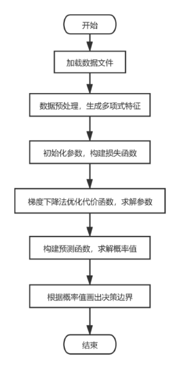
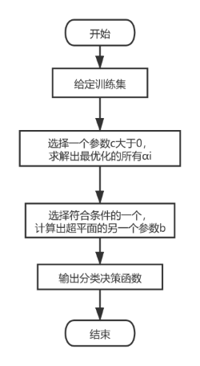
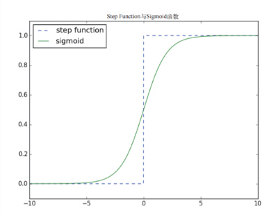
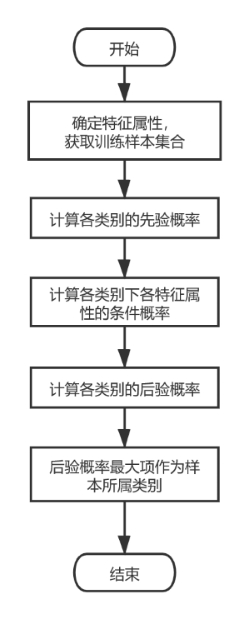
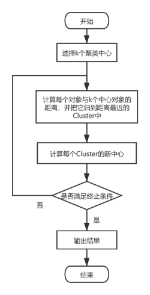
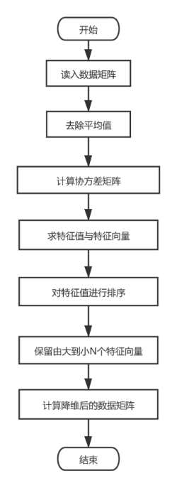
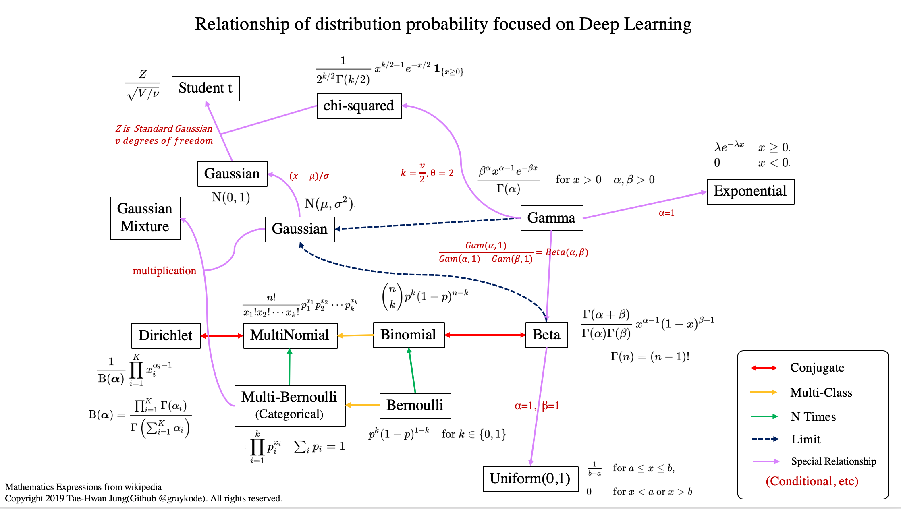

# 机器学习与Scikit-Learn

版本：`0.22.1`


> 说好的只研究Scikit-Learn，终究还是把这里变成了深入学习机器学习的笔记资料库。

- [Python数据分析和机器学习入门练习](../../../python-machine-learning)

# 监督学习、无监督学习、半监督学习、强化学习
| 类型 | 描述 |
|:---:|:---:|
| 监督学习   | 监督学习是最常见的机器学习类别，这种方法是一种函数逼近。我们尝试将一些数据点映射到一些模糊函数。通过智能优化，我们努力拟合出一个最接近将来要使用的数据的函数。|
| 无监督学习 | 无监督学习只是分析数据而没有任何类别的Y来映射，算法不知道输出应该是什么，需要自己推理。 |
| 半监督学习 | 输入数据部分被标识，部分没有被标识，需要先学习数据的内在结构以便合理组织数据。 |
| 强化学习   | 类似于监督学习，只是每个步骤都会产生反馈而已。 |

强化学习模式下，输入数据作为对模型的反馈，不像监督学习那样，输入数据仅仅是作为一个检查模型对错的方式；在强化学习下，输入数据直接反馈到模型，模型必须对刺激立即做出调整。<br/>
强化学习常用的应用场景包括动态系统以及机器人控制等。<br/>
强化学习常见算法包括Q-Learning以及时间差学习等。

举个好玩儿的例子吧：<br/>
想想我们想要训练小鼠，使其学会XX，一般会怎么做？<br/>
一般是给奖惩机制，做对给奖励(强化=>形成依赖)，做错给惩罚(电击之类的=>形成恐惧经验)<br/>
其实，强化学习就和这种操作差不多，只不过“折磨”的是计算机……<br/>


半监督学习允许使用少量的已标注数据为大量的数据生成标签，它在处理大量数据时可能比较实用。<br/>
半监督学习应用场景包括分类和回归，经典算法包括图推理算法、拉普拉斯支持向量机等。<br/>
半监督学习建立的类别可能不是任务中想要的那些类别。

# 开发机器学习系统

## 机器学习适合的问题情形
1. 针对大量数据，能够高效稳定的做出判断
2. 允许预测结果存在一定数量的错误

## 开发流程
1. 明确定义问题
2. 考虑非机器学习的方法
3. 进行系统设计，考虑错误修正方法
4. 选择算法
5. 确定特征、训练数据和日志
6. 执行前处理
7. 学习与参数调整
8. 系统实现

## 可能遇到的困难
1. 存在概率性处理，难以进行自动化测试
2. 长期运行后，由于存储趋势变化而导致输入出现倾向性变化
3. 处理管道复杂化
4. 数据的依赖关系复杂化
5. 残留的实验代码或参数增多
6. 开发和实际的语言/框架变得支离破碎

## 设计要点
1. 如何利用预测结果
2. 弥补预测错误(系统整体如何弥补错误、是否需要人工确认或修正、必要的话去那里弥补预测错误)

## 针对可能出现问题的应对
1. 人工准备标准组对，以监控预测性能 => 1、2、4
2. 预测模型模块化，以便能够进行算法的A/B测试 => 2
3. 模型版本管理，随时可以回溯 => 4、5
4. 保管每个数据处理管道 => 3、5
5. 统一开发/实际环境的语言/框架 => 6

## 监督学习的训练数据
基本包含两类信息：
- 输入信息：从访问日志等提取出的特征
- 输出信息：分类标签或预测值

输出的标签或值可以采用以下方法添加：
- 开发服务日志获取功能模块，从日志中获取（全自动）
- 人工浏览内容，然后添加（人工）
- 自动添加信息，由人确认（自动+人工）

## 获取训练数据的途径
- 利用公开的数据集或模型
- 开发者自己创建训练模型
- 他人帮忙输入数据
- 数据创建众包
- 集成于服务中，由用户输入

# 机器学习数据集的划分
监督学习中，数据集常被分为`训练集、测试集`或者`训练集、测试集、验证集`：
- 训练集用于训练模型的子集，得到模型的未知参数。
- 验证集用于评估训练集的效果，用于在训练过程中检验模型的状态、收敛情况。验证集通常用于调整超参数，根据几组模型上的表现决定哪组超参数拥有较好的性能。
- 测试集用于测试训练后模型的子集，测试集用来评价模型的泛化能力，即之前模型使用验证集来确定了超参数，使用训练集调整了参数，最后使用一个从没有见过的数据集来判断这个模型的性能。

# 机器学习成果评价
常见基础指标：
- 准确率(Accuracy)
- 查准率(Precision)
- 召回率(Recall)
- F值(F-measure)

考虑上述指标的概念：
- 混淆矩阵(Confusion Matrix)
- 微平均(Micro-average)
- 宏平均(Macro-average)

其他指标：
- ROC曲线
- 基于ROC的AUG
- ……

更多相关内容欢迎参阅:watermelon:书


## 回归的评价
均方根误差()：<br/>
^{2}}{N}})

```python
from math import sqrt

def rmse(predicts, actuals):
    sum = 0
    for predict, actual in zip(predicts, actuals):
        sum += (predict - actual)**2
    return sqrt(sum / len(predicts))
```

现成的函数是：`sklearn.metrics.mean_squard_error`

可决系数()：<br/>
^{2}}{\sum_{i}(predict_{i}-\bar{actual_{i}})^{2}})

# 批量处理、实时处理、批次学习、逐次学习
- 处理方式：
    - 批量处理：成批处理某事物。
    - 实时处理：对随时传来的传感数据或日志数据的逐次处理。
- 学习方式（需要的数据群不同，学习的优化方针不同）：
    - 批次学习：权重计算需要所有的训练数据，运用所有数据才算出最优权重。
    - 逐次学习：给定一个训练数据，就立即计算一次权重。
- 可行的组合：
    - 采取批量处理方式进行批次学习（使用Web应用或者API）
    - 采用批量处理方式进行逐次学习（使用数据库）
    - 采用实时处理方式进行逐次学习

# 相关和回归
相关和回归都是研究两个变量相互关系的分析方法。

相关分析研究两个变量之间相关的方向和密切程度，但不能指出两个变量关系的具体形式，也不能从一个变量的变化来推测另一个变量的变化关系。

回归方程则是通过一定的数学方程来反映变量之间相互关系的具体形式，以便从一个已知量来推测另一个未知量。回归分析是估算预测的一种重要方法。

相关和回归的具体区别有：
1. 相关分析中变量之间处于平等地位；回归分析中因变量处于被解释的地位，自变量用于预测因变量的变化。
2. 相关分析中不必确定自变量和因变量，所涉及的变量可以都是随机变量；回归分析则必须事先确定具有相关关系的变量中，哪个是自变量，哪个是因变量。一般来说，回归分析中因变量是随机变量，而把自变量作为研究时给定的非随机变量。
3. 相关分析研究变量之间相关的方向和程度，但相关分析不能根据一个变量的变化来推测另一个变量的变化情况；回归分析是研究变量之间相互关系的具体表现形式，根据变量之间的关系来确定一个相关的数学表达式，从而可以从已知量来推测未知量。
4. 对于两个变量来说，相关分析只能计算出一个相关系数；而回归分析有时候可以根据研究目的的不同建立两个不同的回归方程。

相关分析和回归分析是广义相关分析的两个阶段，有着密切的联系：
1. 相关分析是回归分析的基础和前提，回归分析则是相关分析的深入和继续。相关分析需要依靠回归分析来表现变量之间数量变化的相关程度。只有当变量之间高度相关时，进行回归分析寻求其相关的具体形式才有意义。如果在没有对变量之间是否相关、相关方向和程度之间做出正确判断之前，就进行回归分析，很容易造成“虚假回归”。
2. 由于相关性分析只研究变量之间相关的方向和程度，不能推断变量之间相互关系的具体形式，也无法从一个变量的变化来推测另一个变量的变化情况。因此在具体应用过程中，只有把相关分析和回归分析结合起来，才能达到研究和分析的目的。

# 概率和似然
概率是指在特定环境下某件事情发生的可能性，描述了参数已知时随机变量的输出结果。<br/>
似然是指在确定的结果下去推测产生这个结果的可能参数，描述了已知随机变量输出结果时未知参数的可能取值。

比如掷硬币这个事情：
- 如果说我们已知正常条件下得到硬币正反两面各有50%可能性，然后去预测掷硬币得到正面还是反面，这体现的是概率。
- 如果说我们已知掷硬币1000次得到510次正面和490次反面，然后去预测掷硬币得到正面的概率和反面的可能性，这体现的是似然。

似然函数的值越大，越能说明该事件在对应条件下发生的可能性越大，这就是极大似然。<br/>
机器学习关注极大似然是因为我们往往需要根据已知事件来找出产生这种结果最可能的条件，从而能根据这些条件去预测未知事件的概率。

表示似然函数时通常两边取对数，称之为对数似然函数，这样对求导比较方便：<br/>
=\ln{L(\theta)}=\ln{\prod_{i=1}^{n}{p(x_{i};\theta)}}=\sum\limits_{i=1}^{n}{\ln{p(x_{i};\theta)}})

# 机器学习算法评述

## 分类
分类方法是一种对离散型数值随机变量进行预测和建模的算法。

### 感知机
感知机利用了布尔逻辑的思想，更进一步的点在于其包含了更多的模糊逻辑，它通常需要基于某些阈值的达到与否来决定返回值(简单模拟人脑神经元)，它将线性可分的数据集中的正负样本点精确划分到两侧的超平面。

学习感知机是学习SVM和神经网络的基础，它通过激活函数处理特征和参数模型的线性组合来对实例进行分类(如果将感知机看做神经网络的单一神经元的话，它的函数就是简单的线性函数)，可用于求解二分类问题。

感知机的特点：
- 在线学习(学习算法可以更新单个训练实例而无需批量训练实例，这样对因空间消耗过大无法在内存中完成训练的数据集非常有用)
- 误差驱动
- 预测性能一般，但学习效率高
- 感知机的解可以有无穷多个(它只要求训练集中所有样本都能正确分类即可)
- 易导致过拟合(甚至可以说没怎么考虑模型的泛化能力)
- 只能解决线性可分问题(决策边界是直线)

显然，感知机不能处理XOR（典型线性不可分）。

感知机算法结构：<br/>
<br/>
比较规范的表示是：<br/>
=\Phi(\sum\limits_{i=1}^{n}{w_{i}x_{i}+b})=\Phi(w^{T}x+b))<br/>
wi代表模型参数，b是误差项常数，φ代表激活函数。

感知机的参数的权重向量常用随机梯度下降法(SGD)来确定，和正类相关的权重值为正数，和负类相关的权重值为负数。

感知机的激活函数应该选择类似于阶跃函数的、能将输出值进行非线性变换的函数(神经网络的激活函数是连续可导的)，比如经典的海维赛德阶跃函数(单元阶跃函数)：<br/>
<br/>
使用Sigmoid函数也可以，后面会提到。

感知机的损失函数一说是Hinge函数max(0, -twx)，一说是被误分类的样本点到当前分离超平面的相对距离的总和：<br/>
=-\sum\limits_{x_{i}\in{E}}{y_{i}(w\cdot{x_{i}}+b)})<br/>
这个式子也可以表示为(由于y=±1)：<br/>
=\sum\limits_{x_{i}\in{E}}{\vert{w\cdot{x_{i}}+b}\vert})<br/>
我们应该让这个损失函数尽可能小。值得一提的是，)所描述的相对距离和真正意义上的欧氏距离不同。<br/>
损失函数对w和b求偏导数，就可以写出感知机模型梯度下降算法。

无论学习速率多少，感知机算法在M足够大的情况下一定能训练处一个使得E=φ的分离超平面(Novikoff定理)。

感知机和SVM类似，可以使用核技巧。核感知机的对偶算法比较简单，只需要直接使用核函数替换掉相应内积即可：
=w^{T}x+b=\sum{\alpha_{i}y_{i}{(x_{i}}^{T}x)+b})<br/>
原始形式和对偶形式最大的不同在于，原始形式计算了模型参数和测试实例特征向量的内积，而对偶形式计算了训练实例和测试实例特征向量的内积。对偶形式的这种计算方式可以帮助我们优化感知机模型，处理线性不可分问题。<br/>
特征映射到更高维度空间的定义的形式化表示：<br/>
})<br/>
:R^{d}\to{R^{D}})<br/>
在特征向量上执行映射来把数据映射到一个更高维度的空间中：<br/>
=\sum{\alpha_{i}y_{i}{(x_{i}}^{T}x)+b})<br/>
=\sum{\alpha_{i}y_{i}{(\phi(x_{i})}^{T}{\phi(x)})+b})<br/>
核的规范化定义：<br/>
=\phi(x_{i})^{T}\phi(x_{j}))

举个例子：x=(x1,x2),z=(z1,z2)<br/>
=x^{2})<br/>
^{T}\phi(z)=(x_{1}^{2},x_{2}^{2},\sqrt{2}x_{1}x_{2})^{T}(z_{1}^{2},z_{2}^{2},\sqrt{2}z_{1}z_{2}))<br/>
=(x^{T}z)^{2}=(x_{1}z_{1},x_{2}z_{2})^{2}=x_{1}^{2}x_{2}^{2}+2x_{1}x_{2}z_{1}z_{2}+z_{1}^{2}z_{2}^{2})<br/>
所以验证了：<br/>
=\phi(x)^{T}\phi(z))

关于核的具体内容，SVM有更详细的阐述。

前面也提到了感知机算法是不支持非线性可分数据集的二分类问题的，有两种模型会帮助到我们：
- ANN：通过一个由感知机组成的图来创建一个通用函数逼近器
- SVM：通过将数据投影到更高维空间来试图使其线性可分

### (用于分类的)线性模型

#### 二分类线性模型
线性模型用于回归问题时，y是特征的线性函数(直线/平面/超平面)；而用于分类时，决策边界是输入的线性函数(二元线性分类器是利用直线、平面或超平面来分开两个类别的超平面)

学习线性模型有很多算法，区别在于：
- 系数和截距的特定组合对训练数据拟合好坏的度量方法（损失函数）（此点对很多应用来说不那么重要）
- 是否使用正则化，以及使用哪种正则化方法

最常见的两种线性分类算法：
- Logistic回归
- 线性支持向量机

用于分类的线性模型在低维空间看起来可能非常受限，因为决策边界只能是直线或者平面。

对线性模型系数的解释应该始终持保留态度。

##### 逻辑回归
逻辑回归命名为“回归”，由于引入了Sigmoid函数，所以也可以作为分类算法，它常被用作比较各种机器学习算法的基础算法。

线性回归中，因变量是连续的，它可以是无限数量的可能值中的任何一个；而在逻辑回归中，因变量只有有限数量的可能值(分类值)。

逻辑回归是一种概率型非线性回归，它针对事件发生的概率进行预测。

逻辑回归与感知机相似，它的特点是：
- 除了输出以外，还给出输出类别的概率值
- 既可以在线学习也可以批量学习
- 预测性能一般(有时候欠拟合)，但学习速度快
- 结构简单、原理清晰，但在多特征、多类别的数据环境下容易过拟合
- 为防止过拟合，可以添加正则化项（这点比感知机好）
- 只能分离线性可分数据，决策边界也是直线
- 数据集特征值缺失或特征空间过大会导致逻辑回归精度不高

逻辑回归的激活函数是Sigmoid函数(Logistic函数)，损失函数是交叉熵误差函数。

关于Logistic函数，可以认为它是一种“可导的阶跃函数”(单纯的阶跃函数是不连续的所以肯定不可导故不能用到机器学习中)，进而将其作为连接线性连续值和阶跃离散值的桥梁。
它的表达式是：<br/>
=\frac{1}{1+e^{-x}})


根据Logistic函数的表达式可知：对于Logistic函数，自变量越接近于-∞，函数值越接近于0，而自变量越接近于+∞，函数值越接近于1。

所以，逻辑回归拟合模型公式为：<br/>
=\frac{1}{1+e^{-x_{i}\beta}})

根据表达式，我们可知Logistic回归是怎样基于Logistic函数将线性模型的预测结果映射成分类问题所需要的预测结果的：
1. 将线性模型的输出和Logistic函数的输入串联起来。
2. 当样本为负类时，让线性模型输出的预测值小于0，且越小越好。
3. 当样本为正类时，让线性模型输出的预测值大于0，且越大越好。

有了Logistic函数进行映射，线性模型不再需要输出某个特定的值，只需满足“让输出(加上Logistic函数以后)尽可能接近0或1”即可，这是不难做到的。（这种操作在深度学习中并不罕见）

线性回归通过最小化误差平方和的方式来拟合模型，最终选出令得到这些观测数据的最大的β。<br/>
但逻辑回归这里可不是这样的，我们可以直接使用梯度下降法来最大化似然，也就是说我们要计算似然函数及其梯度。

=\frac{1}{1+e^{-x_{i}\beta}})<br/>
由上式知：已知β的情况下，我们的模型指出每个等于1的概率为)，等于0的概率为)

逻辑回归的损失函数：<br/>
={f(x_{i}\beta)}^{y_{i}}{(1-f(x_{i}\beta))}^{(1-y_{i}))

事实上，最大化对数似然函数会更简单一些：<br/>
={y_{i}}log{f(x_{i}\beta)}+{(1-y_{i})log(1-f(x_{i}\beta))})<br/>
由于对数函数是单调递增的，所以任何能够最大化对数似然函数的β也必然能最大化似然函数，反之亦然。

关于最大化似然函数这个问题，使用一般的解法如极大似然估计是难以求解方程的。此时应该使用迭代的解法(如梯度下降法)去进行最优化。<br/>
求导的时候Sigmoid函数有一个性质需要知道：<br/>
=g(z)(1-g(z)))

手动实现基于梯度下降的逻辑回归时，核心是`gradientDescent()`的编写。

Logistic函数不是直接得到离散的0/1值，它给出的是一种概率。特别是看上面给出的损失函数，这种形式与伯努利分布很相似。

逻辑回归的算法流程：
1. 为假设函数设定参数w，通过假设函数计算出一个预测值。
2. 将预测函数带入损失值，计算出一个损失值。
3. 通过得到的损失值，利用梯度下降等优化方法调整参数w，不断重复这个过程直到损失最小。

逻辑回归算法流程图：<br/>


逻辑回归处理过拟合可以采用与线性回归类似的方法，添加的正则项也很类似。

逻辑回归的应用：
1. 简单二分类问题的求解
2. 作为其他复杂算法的“零件”，如神经网络算法的激活函数就使用到了Sigmoid函数

#### 多分类线性模型
除了逻辑回归，绝大多数的线性分类模型只能适用于二分类问题，而不直接适用于多分类问题，推广的办法是“一对其余”。<br/>
也就是说，每个类别都学习一个二分类模型，将这个类别与其他的类别尽量分开，这样就产生了与类别个数一样多的二分类模型。<br/>
至于预测如何运行，显然是在测试点上运行所有的二分类器来预测，在对应类别上“分数最高”的分类器“胜出”，将这个类别的标签返回作为预测结果。

多分类的逻辑回归虽然不是“一对其余”，但每个类别也都有一个系数向量和一个截距，预测方法其实相同。

#### 多标签线性分类模型
二元分类和多元分类都要求每个实例必须分配给一个类集合中的一个类。而多标签分类则是要求每个实例可以被分配给类别集合的一个子集。

多标签分类的一个实例是论坛中的消息分类标签。

多标签分类问题的解决方是将原多标签分类问题转化为一系列单标签分类问题：
1. 将训练数据中出现的每个标签集转换为单个标签。
2. 对训练集中的每个标签训练一个二元分类器，每个分类器预测实例是否属于某个标签。

多标签分类问题的性能评价指标可选汉明损失和杰卡德相似系数
- 汉明损失代表不正确标签的平均比例，它是一种损失函数，完美得分是0。
- 杰卡德相似系数也称杰卡德指数，是预测标签和真实标签交集的数量除以预测标签和真实标签并集的数量，1是完美得（取值在0和1之间）。

杰卡德相似系数计算公式：<br/>
=\frac{\vert{Predicted\cap{True}}\vert}{\vert{Predicted\cup{True}}\vert})

### 支持向量机(SVM)
SVM可以通过超平面到点集的间隔最大化，习得光滑的超平面。

SVM的优点：
- 使用核(Kernel)函数，能分离非线性数据(能处理线性可分数据和线性不可分数据)。
- 如果是线性核，即使是高维稀疏数据也能学习。
- 由于分类使用“支持向量”，训练无需使用所有数据，故在小样本分类问题上有较好表现。
- 既可批量学习也可在线学习。
- SVM是计算最优的，因为它映射到二次规划(凸函数最优化)。
- 理论比较完备，兼具可用性与可解释性。
- 泛化能力较强。
- 适合特征含义相似的中等大小的数据集。
- 不需要数据的归一化预处理，对噪声鲁棒。

SVM的缺点：
- 尽管能处理非线性问题，但对非线性问题的处理缺乏通解。
- 有时找到合适的核函数并非易事。
- 原始的SVM只支持二分类问题(需要拓展)。
- 对样本个数的缩放表现不好且对参数敏感，所以数据预处理和调参需要非常小心(从这点看树模型显得更好一些)。
- SVM模型不易检查，不易向非专家解释。

SVM的损失函数是Hinge函数，与感知机类似，不同的是与横轴交点位置不同。由于相交点不同，对于在决策边界附近勉强取得正确解的数据施加微弱的惩罚项作用，也可以对决策边界产生间隔。

SVM的核心特色：
- 间隔最大化，它与正则化一样可以抑制过拟合，含义是要考虑如何拉超平面使得两个类别分别与最近的数据(支持向量)的距离最大化(决定使得间隔最大化的超平面的拉拽方法相对已知数据创造出间隔)，其实质是一种转换了损失函数的线性方法。
- 核函数方法，它针对线性不可分数据虚构地添加特征，使得数据成为高维向量，最终变成线性可分数据。（如一维线性不可分数据，升为二维，可能就变成了线性可分的）

SVM分类：
- 线性可分SVM(硬间隔)
- 线性SVM(软间隔)
- 非线性SVM

SVM的间隔(margin)分为两种：
- 硬间隔：间隔的一侧必须只能有一种类别，决不允许有例外。
- 软间隔：间隔的一侧不必只能有一种类别，具有一定的弹性(即容错率)。当然，我们要尽量让划错率降低(知道有可能会划错但使之尽可能少)。

点到N维超平面的距离r：<br/>
}=\frac{(w^{T}x^{(i)}+b)}{\Vert{w}\Vert})

间隔最大化算法通常可用SMO(序列最小优化)等算法。

最邻近另一类区域的边缘样本点是SVM划分的重点，这些数据点成为支持向量。<br/>
严格一点将=讲，支持向量是所有数据点中直接参与计算使得间隔最大化的一系列数据点。顾名思义，支持向量正是SVM关注的核心。<br/>
甚至可以说原始版SVM训练好后可以抛弃非支持向量的样本点，此时仍能对新样本进行分类。

SVM处理分类问题要做的是最大化两个(或多个)分类之间的距离。<br/>
切记SVM不是只看间隔的，否则就将沦为普通线性分类器。

由于SVM为了兼顾理论的优雅和运行的高效，选择了紧耦合，故SVM是不可拆的。<br/>
也就是说，不能单独拆出SVM的高维映射作为一个组件使得所有的线性分类器也可以轻易地处理非线性问题。

scikit-learn中实现的SVM在sklearn.svm包中，不同的实现区别主要在核函数的不同选择上，核心思想都是一样的。<br/>
scikit-learn中实现的SVM支持了分类、回归、无监督学习的异常点检测等问题的处理。<br/>
实现的SVM主要有：
- LinearSVC：基于线性核函数的SVM分类算法
- LinearSVR：基于线性核函数的SVM回归算法
- SVC：可选择多种核函数的SVM分类算法
- SVR：可选择多种核函数的SVM回归算法
- NuSVC：类似于SVC，可通过nu参数设置支持向量的数量
- NuSVR：类似于SVR，可通过nu参数设置支持向量的数量
- OneClassSVM：SVM算法解决无监督学习的异常点检测问题

SVC/SVR的核心参数(某些参数可通过网格搜索等进行微调)：
- kernel：核函数类型
    - linear：线性函数
    - polynomial：多项式函数
    - rbf(默认)：径向基函数
    - sigmoid：Sigmoid函数
    - precomputed：预设核值矩阵
- gamma：针对Sigmoid函数、多项式函数、径向基函数的核系数
- C：控制正则化，与逻辑回归的lambda参数类似

SVM应用领域：文本分类、文本情感分析、图像分类、数据挖掘、手写字符识别、行人检测等。

#### 线性可分SVM
只要训练集D线性可分，则SVM算法对应的优化问题的解就存在且唯一。

原始算法核心步骤：<br/>
<br/>


注意对偶形式的训练过程常常会重复用到大量的样本点之间的内积，我们应该提前将样本点两两之间的内积计算出来并存储到一个矩阵(Gram矩阵)中：<br/>
_{N\times{N}})

线性可分SVM算法流程图：<br/>


#### 非线性SVM
非线性SVM需要使用核技巧(注意核技巧重原理，核方法重应用)。

核技巧具有合理性、普适性和高效性的特点，简单来说就是奖一个低维的线性不可分的数据映射到一个高维的空间(这么说不是特别严谨)，并期望映射后的数据在高维空间里是线性可分的。<br/>
核技巧主要是用来提高核方法计算效率的，显然不可能真的就映射到高维空间中，所以上面说并不严谨。实际上它帮助我们只需输入原始向量就可以直接计算得到正确的高维内积结果。

当空间的维数d越大时，其中N个点线性可分的概率越大，这点曾被证明过，构成了核技巧的理论基础之一。

核技巧巧妙的地方在于：它通过定义核函数来避免显示定义映射φ，对构造低维到高维映射并使数据线性可分的过程进行转化，从而简化问题求解。<br/>
换句话说，核技巧使用核函数=\phi(x_{i})\cdot{\phi(x_{j})})替换掉算法中出现的内积来完成将数据从低维映射到高维的过程。<br/>
更准确一点讲，我们使用SVM的核方法不是真的就直接把数据点映射到高维空间去，因为如果数据量大且映射复杂的话，这个过程代价会很大。我们真正要去做的是利用核函数来计算更高维空间中的内积，并用它来寻找超平面。

通过将原始问题转化为对偶问题能够非常简单地对核技巧进行应用。

核技巧的思想是：
- 将算法表述为样本点内积的组合(对偶实现)
- 设法找到核函数)，它能返回样本点、被映射后的内积
- 用)替换\cdot{\phi(x_{j})})，完成低维到高维的映射，也完成了从线性算法到非线性算法的转换
 
其实，核函数不是通常意义上的函数，它是一种功能性函数。凡是能在SVM中完成高维映射这种功能的函数都可称之为核函数。<br/>
核函数主要做两件事：
- 增加空间维度
- 完成现有数据从原空间到高维空间的映射
 
最大间隔、高维映射、核函数都是SVM的精髓。最大间隔是需要达到的目标和效果；高维映射和核函数则是互为因果的关系，解决了当前维度线性不可分的问题。<br/>
我们必须选择一款核函数，才能通过核函数将数据集进行映射，从而得到高维映射的效果。
 
SVM的核函数：
- 线性核：<br/>=(x_{i}\cdot{x_{j}})+r)
- 多项式核(异质和均匀)：<br/>=(\gamma{(x_{i}\cdot{x_{j}})}+r)^p)
- Sigmoid核：<br/>=\tanh(\gamma{(x_{i}\cdot{x_{j}})}+r))
- 径向基核：<br/>=e^{-\gamma||x_{i}-x_{j}||^2})
- 高斯核：<br/>=e^{-\frac{||x_{i}-x_{j}||^2}{2\sigma^2}})

对于需要使用非线性模型处理问题的情况，高斯核是首选。<br/>
高斯核函数本身就是一种径向基核函数，映射特征向量空间中作为决策边界的超平面和原空间中作为决策边界的超平面类似。<br/>
由高斯核产出的特征空间可以拥有无限维度，这是其他特征空间不可能具有的特征。

核函数的种类有很多，但应用时必然是要提前选定的，训练中途不得更换。

虽说高维映射可以解决当前维度线性不可分问题，但无脑做高维映射可能使得维度很高难以处理。<br/>
核函数虽说可以做高维映射，但它会事先在低维进行计算，只是将实际分类效果表现在高维上，这样就避免了在高维空间上的复杂计算。

SVM使用核函数的缺点是容易对数据过拟合，此时避免过拟合的一个方法是引入松弛。

SVM分类(非线性)的算法流程：
1. 选取一个合适的数学函数作为核函数
2. 使用该核函数进行高维映射，使得数据点由当前维度线性不可分变为高维度线性可分。
3. 使用间隔作为度量分类效果的损失函数，最终找到能够让间隔最大化的超平面，完成分类任务。

非线性SVM算法流程图：<br/>


#### 最小二乘SVM
SVM标准算法在应用中存在着超平面参数选择，以及问题求解中矩阵规模受训练样本数目影响很大，导致规模过大的问题。

最小二乘SVM(LS-SVM)是标准SVM的一种变体，它从机器学习的损失函数入手，在其优化问题的目标函数中使用二范数，并利用等式约束条件代替SVM标准算法中的不等式约束条件，使得LS-SVM方法的优化问题的求解最终变为一组线性方程组的求解。

传统SVM的约束条件为不等式，离分离超平面近的元素向量是支持向量，强烈的影响分离平面的计算，里超平面远的向量影响比较小。因此如果分离集合之间的边界不清晰，会影响计算结果。<br/>
而LS-SVM中，约束条件时等式，因此分离超平面近和远的元素向量都会对分离平面产生影响，分离平面不如传统SVM精准；而且一旦产生相当数量的大的离群点，会严重影响分离平面的计算。LS-SVM的最终结果，近似于将两个分离集合的所有元素到分离平面的距离，都限定在1+n(n是可接受误差)。

LS-SVM方法通过求解线性方程组实现最终的决策函数，在一定程度上降低了求解难度，提高了求解速度，使之更适合求解大规模问题，更适应于一般的应用。虽然不一定能获得全局最优解，但仍可获得较高精度的识别率。

#### 概率SVM
概率SVM是逻辑回归和SVM的结合，SVM的决策边界直接输出样本分类，概率SVM则通过Sigmoid函数计算样本属于其类别的概率。

在计算标准SVM得到学习样本决策边界后，概率SVM通过缩放和平移参数对决策边界进行线性变换，并使用极大似然估计得到的值，将样本到线性变换后超平面的距离作为Sigmoid函数的输入得到概率。

#### 多分类SVM
前面描述的SVM基本都是二分类SVM，而SVM也可以处理多分类问题。

SVM处理多分类问题有两种主要的思路：
- 将整个多分类SVM拆分成多个二分类SVM问题综合起来处理。
    - 一对多(OvR)，即将每一个样本与其它k-1个样本进行分类(类似于k折交叉验证)，最终选择取得最大值的类别就是预测的类别。<br/>这种方法训练的SVM少，但每个SVM都需要使用全部训练样本。
    - 一对一(OvO)，即在不同类别的样本之间两两分类训练，形成}{2})个二分类SVM，每一次预测都需要综合所有二分类SVM的预测，计票决定最终类别。<br/>这种方法每个SVM不需要使用全部训练样本，但训练的SVM可能会过多。
    - 有向无环图(DAG)，类似于OvO，只是DAG会将}{2})个模型化作一个有向无环图的}{2})个节点并逐步进行决策。
- 将整个多分类问题归结为一个最优分类超平面的问题，一次性解决多分类问题。这种方法需要求解的变量太过复杂，运行效率远低于第一种。

### 神经网络
神经网络在很多方面都是接近完美的机器学习结构，它可以将输入数据映射到某种常规的输出，具备识别模式以及从以前的数据中学习的能力。

学习神经网络之前，可以先学习一下感知机，二者有某些相似之处。但与感知机不同的是，神经网络可以用于模拟复杂的结构。

神经网络很早很早就被提出了，那时是M-P模型，后来又引入了非线性函数(激活函数)，到达第一个研究高潮。<br/>
图灵奖得主马文.闵斯基证明了单层神经网络永远不可能解决非线性问题，而当时又没有解决多层网络传递误差的解决方法，所以低潮来临。<br/>
反向传播BP算法的提出解决了这种困难，并被沿用至今。<br/>
而深度学习能有今天的成就，除了理论的完善、研究人员的增加、卷积层和池化层这些神经网络部件的出现等因素，主要还得归功于硬件的进步。毕竟，没有高性能硬件就很难支持大规模神经网络的训练。

神经网络特别的一点在于它使用了一层隐藏的加权函数，称为神经元。在此隐藏层中，我们可以有效地构建一个使用了许多其他函数的网络。而如若没有隐藏层的这些函数，神经网络只是一组简单的加权函数罢了。

神经网络可以使用每层神经元的数量表示。<br/>
例如，输入层20个神经元，隐藏层10个神经元，输出层5个神经元，则可称之为20-10-5网络。

异或神经网络Demo：<br/>
<br/>

输入层：神经网络的入口点，是模型设置的输入数据的地方，这一层无神经元，因为它的主要目的是作为隐藏层的导入渠道。

神经网络的输入类型是一定要标记的，然而输入数据类型只有两种：
- 对称型：标准输入的值的范围在0和1之间，如果输入数据比较稀疏，结果可能出现偏差(甚至有崩溃的风险)。
- 标准型：对称输入的值的范围在-1和1之间，有利于防止模型因为清零效应而崩溃。它较少强调数据分布的中间位置，不确定数据可映射为0并被忽略掉。

如果没有隐藏层，神经网络将是一些线性加权线性函数的组合；隐藏层的存在给神经网络赋予了为非线性数据建模的能力。实际的神经网络的隐藏层可能有N个。<br/>
每个隐藏层包含一组神经元，这些神经元的输出将传递给输出层。

神经元是封装在激活函数中的线性加权组合。加权线性组合是将从前面所有神经元得到的数据聚合成一个数据，用于作为下一层的输入。<br/>
当神经网络一层一层输送信息时，它将前面一层的输入聚合为一个加权和。

神经网络的基本组成单元是层(Layer)而不是神经元节点，层与层之间通过权值矩阵和偏置量来连接。其中能将结果从原来的维度空间映射到新的维度空间，则能打破对称性。

神经网络模型的每一层都有一个激活函数，激活函数是在标准范围或对称范围之间规范化数据的方式，是模型的非线性扭曲力，是ANN的核心。<br/>
根据如何在训练算法中决定权重，我们需要选择不同的激活函数。<br/>
使用激活函数的最大优点在于，它们可以作为缓存每层输入值的一种方式。这一点很有用处，因为神经网络可以借此寻找模式和忽略噪声。

激活函数有两个主要类别：
- 倾斜函数：很好的默认选择
- 周期函数：用于给大量噪声的数据建模

下表是一些常见的激活函数：

| 名称 | 标准型输入 | 对称型输入 |
|:---:|:---:|:---:|
| Sigmoid |  |  |
| Cosine | }{2}}+0.5) | ) |
| Sine | }{2}}+0.5) | ) |
| Gaussian |  |  |
| Elliott |  |  |
| Linear | ) | ) |
| Threshold |  |  |

[神经网络激活函数可视化](#神经网络激活函数可视化)

- Sigmoid是与神经元一起使用的默认函数，因为其有能力做平滑决策：<br/><br/>但Sigmoid函数也并非完美无缺，它在0点附近(特别是(-1,1)之间几乎成为直线)图像趋于平缓，在使用梯度下降等最优化方法的时候很容易导致梯度弥散甚至梯度消失。
- Tanh函数可以取代Sigmoid函数。<br/>它同样属于“可导的阶跃函数”，但梯度更大，使用梯度下降等优化算法时收敛更快，学习时间更短。<br/>Tanh函数仍存在不足，因其仍然是越接近0点变化率就越小(尽管比Sigmoid函数好点)。
- ReLU函数则比Sigmoid、Tanh等函数更有优势。

输出层具有神经元，这是模型给出数据的地方。与输入层一样，输出的数据也是对称型或标准型的。输出层有多少个输出，是正在建模的函数决定的。

构建神经网络之前，要思考到这样三个问题：
- 使用多少隐藏层？隐藏层的数量没有明确的限制，有三种启发式方法可提供帮助：
    - 不要使用两个以上的隐藏层，否则可能出现数据过拟合的情况。如果隐藏层数量太多，神经网络就会开始记忆训练数据。
    - 通常来说，一个隐藏层的工作，近似于对数据做一个连续映射。大多数神经网络中都只有一个隐藏层而已。
    - 两个隐藏层之间可能不做连续映射。这种情况比较罕见，如果不想做连续映射，可以使用两个隐藏层。
- 每个隐藏层有多少神经元？由于强调的是应该聚合而非扩展，有三种启发式方法可提供帮助：
    - 隐藏神经元的数量应该在输入神经元数量和输出神经元数量之间。
    - 隐藏神经元的数量应该为输入神经元数量的三分之二，加上输出神经元的数量。
    - 隐藏神经元的数量应该小于输入神经元的数量。
- 神经网络的容错率和最大epoch是多少？
    - 容错率太小的话，训练时间会变长。
    - 一般可以选择1000个epoch或迭代作为训练周期的起点。如此，可以建立一些复杂模型，却也不用担心训练过度。
    - 最大epoch和最大误差共同定义了解决方案的收敛点，它们作为一种信号，告诉我们可以什么时候停止算法的训练，生成一个神经网络。

损失函数：
- 距离损失函数(最小平方误差准则)：<br/>)={\Vert{y-G(x)}\Vert}^{2}=[y-G(x)]^{2})
- 交叉熵损失函数(交叉熵是信息论中的概念，此函数要求G(x)的每一位取值都在(0,1)中)：<br/>)=-[ylnG(x)+(1-y)ln(1-G(x))])
- log-likelihood损失函数(要求G(x)是一个概率向量，假设y∈ck)：<br/>)=-lnv_{k})

损失函数往往与激活函数搭配，常见几种组合：
- Sigmoid或其他+距离损失函数(MSE)
- Sigmoid+交叉熵损失函数(CrossEntropy)
- Softmax+交叉熵损失函数(CrossEntropy)或log-likelihood损失函数

优化器(Optimizer)的常见实现方法：
- Vanilla Update
- Momentum Update
- Nesterov Momentum Update
- RMSProp
- Adam

神经网络的优点：
- 网络结构的扩展性好，可以构建非常复杂的模型
- 只需简单调参即可解决复杂非线性问题

神经网络缺点：
- 可解释性差
- 调参依赖经验
- 可能陷入局部最优解(如使用梯度下降)
- 对数据缩放敏感
- 对参数选择敏感
- 大型网络训练周期很长，消耗大量计算资源

控制神经网络复杂性的关键指标：
- 隐藏层的个数
- 每个隐藏层中的单元个数与正则化(alpha)

神经网络发展至今，已经具备了如下特征：
- 极强的非线性映射能力
- 强大的计算能力和求解实际问题的能力
- 较强的样本识别与分类能力
- 良好的泛化能力

神经网络可解释性差，我们可能不知道模型学到了什么。想要尝试了解模型学到的东西，可以考虑查看模型权重，也可以尝试将连接隐藏层和输出层的权重可视化。

神经网络训练起来有点像盲人摸象，参数调节依赖于经验。<br/>
神经网络调参的一种常用方法是：<br/>
首先创建一个大到足以过拟合的网络，确保这个网络可以对任务进行学习。知道训练数据可以被学习后，要么缩小网络，要么增大alpha来增强正则化，这可以提高泛化性能。

神经网络包括三种基本的类型：
- 前馈神经网络：通过有向非循环图定义。
- 反馈神经网络/递归神经网络(包含循环)：可以表示网络的一种内部状态，可导致网络的行为基于本身的输入随着时间变化而发生变化。
- 自组织神经网络(引入竞争层的无监督学习)

#### 前馈神经网络(BPNN)
前馈神经网络通过有向非循环图定义。

多层感知机模型是一种典型的前馈神经网络：<br/>
<br/>
)<br/>
参数值说明：
- w能把从激活函数得到的函数值线性映射到另一个维度的空间上
- b能在此基础上再进行一步平移的操作

对于三层前馈神经网络，其按输入层、中间层、输出层的顺序对输入和权重进行乘积加权，用所谓softmax函数对输出层最后的计算值进行正规化处理(注意不是直接输出的)，得到概率结果。<br/>
前馈神经网络利用误差反向传播算法进行学习。根据随机初始化得到的权重值，沿着网络正向，计算输出值。再沿着网络反向，计算输出值与正确值的误差，从而修正权重值。如果权重值的修正量小于某个规定值，或者达到预设的循环次数，学习结束。

我们可能会认为简单的增加中间层的层数就使神经网络变得更加复杂，更加有效。而事实上，单纯地增加神经网络的中间层的层数，是会导致BP算法无法进行学习的情况。<br/>
BP神经网络通常使用单隐藏层，事实上它也只适用于训练浅层网络模型。

每个神经元的权重源自训练算法。训练算法通过迭代(epoch)，给每个神经元找到最优的权重值。<br/>
每个epoch中，算法遍历整个神经网络，并将其与预期的结果进行比较。如果比较结果是错误的，算法将对神经元的权重值进行相应的调整。<br/>
训练算法有很多种，比较典型的是：
- 反向传播算法：<br/>}=-\alpha{(t-y)}\phi'{x_{i}}+\epsilon\Delta{w(t-1)})<br/>反向传播中，通过链式法则求导可以不断反向求出神经网络中任一神经元的损失值，从而让每个神经元都能根据损失值完成调整。
- QuickProp算法：<br/>}=\frac{S(t)}{S(t-1)-S(t)}\Delta{w(t-1)})
- Rprop算法(用的较多)：不根据公式计算权重变化，它仅使用权重改变量的符号，以及一个增加因子和减小因子。

不同的神经网络训练算法有一个共同点：它们试图找到一个凸误差表面的最优解，即梯度下降。<br/>
神经网络确实可以使用梯度下降算法来更新参数，但这可能不是效果最好的，我们需要一些与之类似的扩展算法。<br/>
这样的扩展算法区别于梯度下降算法的点在于：
- 更新方向不是简单地取为梯度。
- 学习速率不是简单地取为常量。

动态学习速率调整公式：<br/>


神经网络训练时，迭代运算计算权重会比较快，这样做不试图计算关于权重的误差函数的导数，而是计算每个神经元权重的权重变化，此为delta规则：<br/>
)\phi'(h_{j})}x_{i})<br/>
这说明神经元j的第i个权重变化为：`alpha * (expected - calculated) * derivative_of_calculated * input_at_i`

BP神经网络算法流程：
1. 确定输入层、隐藏层、输出层的神经元数目，对输入值和输出值进行归一化处理，设定学习率、最大训练次数、神经元激活函数(默认可选Sigmoid)，初始化神经网络中所有神经元激活函数的权值……
2. 输入层接收输入，通过向前传导算法生成各层的激活值，最终产生输出。
3. 通过输出层的激活值和损失函数来做决策并获得损失。损失函数：<br/>=L(y,v^{(m)}))
4. 通过反向传播算法算出各个Layer的局部梯度：<br/>}=\frac{\partial{L(x)}}{\partial{u^{(i)}}})，最终更新权值。
5. 使用各种优化器优化参数。

隐藏层神经元数目的经验公式(m为隐藏层节点数，n为输入层节点数，l为输出层节点数)：<br/>
- 
- 

BP神经网络算法流程图：<br/>


神经网络向前传导和反向传播的区别：向前传导是由后往前将`激活值`一路传导(由输入数据产生输出的过程)，反向传播则是由前往后将`梯度`一路传播(进行调整和优化)。<br/>
值得一提的是：“前”与“后”是由Layer与输出层的相对位置给出的，越靠近输出层的Layer越前，反之越靠后。

scikit-learn中BP神经网络被称为多层感知机(MLP)：
- MLPClassifier(分类)
- MLPRegressor(回归)
- BernoulliRBM(分类)

普通前馈神经网络的缺点：
- 容易陷入局部最优解。
- 神经元过多且网络过深时，权值数量倍增，解空间维度过高，后续训练易导致过拟合。
- 迭代次数过多也容易导致过拟合。
- ……

BP算法虽然是传统的训练多层网络结构的经典算法，但是它只能训练浅层网络(隐藏层可能只有一两层甚至没有)结构，对深层网络训练效果不佳。<br/>
BP算法训练时不仅难以用于复杂的识别，还容易过拟合。

深度学习采用逐层初始化来克服深度网络下BP算法的缺陷，它先用无监督学习方法进行分层训练，将上一层输出作为下一层的输入，从而得到各层参数的初始值，这样就使得网络的初始状态更接近最优值，提升了后续的性能。

深度学习突出了特征学习的重要性，同时更具有鲁棒性。它在解决传统神经网络算法的同时，充分地利用了大数据进行学习，基于自身的学习能力能更深入地划分数据丰富的内在信息。

深度学习常用的神经网络：DNN(深度神经网络)、CNN(卷积神经网络)、RNN(循环神经网络)。它们都是对BP神经网络的扩展。

#### 卷积神经网络(CNN)
CNN与传统BP算法最大的不同在于：
- CNN相邻层之间的连接不是全连接而是部分连接，即某个神经元的感知区域只来自于前一层的部分神经元而非BP那样的全部连接，大大降低了训练参数的数目。
- CNN在隐藏层中引入了卷积层和自采样层构成的特征抽取器，大大增强了算法特征学习的能力，实现了算法的优化与高效。

这些优化构成了CNN的主要特点：
- 局部感受野：对应一种卷积核，通过卷积核的特征扫描，可实现网络神经元的部分连接而非全连接，可大大减少训练参数。（感受野用来表示网络内部不同神经元对原图像感受范围的大小，即CNN结构中某个特征映射到输出空间的区域大小）
- 权值共享：在卷积核特征扫描的过程中，同一个卷积核内所有神经元的权值与偏差值是相同的，可大大减少训练参数。与此同时，为防止参数过少，可以多加几个卷积核。
- 降采样：降采样层主要作用是简化卷积层输出的信息，所以通常位于卷积层之后，它对前一层中的特征映射进行浓缩，形成一个个新的映射。在完成卷积层特征提取之后，对于每一个隐藏层单元，将卷积特征划分为数个不重合的区域，用这些区域的最大(或平均)特征来表示降维后的卷积特征，然后用这些均值或最大值参与后续的训练，此过程叫池化。

CNN比之NN特殊之处卷积的实现方案：
- 将卷积步骤变为较大规模的矩阵相乘
- 利用快速傅里叶变换(FTT)求解

常见池化方法有两种：
- 极大池化，它会输出接收到所有输入中的最大值。
- 平均池化，它会输出接收到所有输入中的平均值。

CNN算法流程图：<br/>


[CNN网络架构演进：从LeNet到DenseNet](https://www.cnblogs.com/skyfsm/p/8451834.html)

#### 循环神经网络(RNN)
RNN算法流程图：<br/>


### K近邻(KNN)
KNN是一种搜索最邻近的算法。当输入一个未知的数据时，该算法根据邻近的K个已知数据所属类别，以多数表决的方式确定输入数据的类别。它不仅仅可以用作一个分类器，还可以用于搜索类似项。

KNN是一种惰性学习算法，因为不具有记忆功能，而是通过计算来完成预测。

KNN和其他算法的比较：
- 比起朴素贝叶斯，KNN的规则简单很多(因为只涉及特征与类别之间的简单关联)。
- 比起Logistic等使用损失函数和最优化方法(如梯度下降等)来不断调整线性函数权值进而达到拟合的算法，KNN依靠“多数表决”的思想求得最优解。
- Logistic算法依靠加权求和处理维度的选择，KNN依然是依靠“多数表决”的思想来处理此问题。

“多数表决”的思想其实有着深刻的道理，在计算机科学的很多地方都有应用：
- KNN等算法
- 自治的计算机体系结构(如分布式系统)
- 区块链

KNN是一种惰性模型和非参数模型，它不会从训练数据中估计固定数量的模型参数，而是将所有的训练实例存储起来，并使用距离测试实例最近的实例去预测相应变量。
- KNN的惰性体现在它在训练阶段不会估计模型生成的参数。惰性学习模型几乎可以立即进行预测，但需要付出高昂的代价。
- KNN的非参数不是指它没有参数，而是指它不使用固定数量的参数或者系数去定义能够对数据进行总结的模型，其参数的数量独立于训练实例的数量。

KNN的优点(KNN是向量空间模型下较好的分类算法)：
- KNN容易理解，实现简单，不需要太多的调节就容易取得不错的性能，只要距离得当就比较容易取得不错的应用效果。
- KNN可以避免试图不断减小误差的最优化算法可能将局部最优解误认为全局最优解的问题，求得全局最优解。
- 添加新数据时不需要对整个数据集进行重新训练，可实现在线训练。
- 更能适应类和类交叉或者可能出现类别重叠较多的待分类样本数据集。
- 适用于小型数据集，是一种很好的基准模型。

KNN的缺点（导致实际用的少）：
- 对样本分布比较敏感，正负样本分布不平衡时会对结果产生明显影响。
- 难以处理具有很多特征的数据集(比如文本分类选择特征词或词组的数量过大导致文本向量维数过高难以计算)。
- 数据规模大时计算量可能很大，得到结果也比较慢。

KNN优化思路(理论导向)：
- 改进距离(相似度)测算公式。
- 引入概率估计方法改进类别判定机制。
- 弱化或消除参数K对分类精度的影响。
- 引入近邻权值机制，衡量权值累积以及训练集中各种分类的样本数目，来对K值进行调整，进而达到更合理或更平滑的分类效果。

KNN优化思路(实践导向)：
- 在数据预处理阶段可以利用一些降维算法或使用特征融合算法，对KNN训练集的维度进行简化，排除对分类结果影响较小的属性，以降低计算开销。
- 通过减少训练样本来减少计算量。
- 建立高效索引或引入高效搜索算法来加快寻找测试样本最近邻的速度。

NLP等具有高维稀疏数据的领域(维度灾难)，常常无法直接使用KNN获得良好的预测性能(高维空间过于巨大以以至于其中的点根本不会表现出彼此邻近)，需要进行降维处理。

KNN的两个核心超参数：
- K值
- 数据点之间距离的度量方法(距离的计量方法)

K值选取不当的后果：
- 过大：虽然导致学习的估计误差较小，但也会使得学习的近似误差增大。此时模型过于简单，忽略了训练实例中大量的有效信息。
- 过小：虽然导致学习的近似误差较小，但也会使得学习的估计误差增大。此时模型考虑的因素过少，容易受到异常因素影响，发生过拟合。

K值的选择方法(二分类问题最好选奇数以防止平局)：
- 猜测式选择(根据经验一般在3-10之间)
- 启发式选择
    - 挑选互质的类和K值
    - 选择大于或等于类数+1的K
    - 选择足够低的K值以避免噪声(如果K值等于整个数据集则相当于默认选择最常见的类)
- 使用搜索算法选择：
    - 暴力搜索
    - 遗传算法(相关论文已附)
    - 网格搜索(使用交叉验证)
    - K-d树搜索(依靠数据结构优化搜索，通过矩形划分空间)
    - 球树搜索(通过球形划分空间，解决了K-d树处理不均匀分布的数据集时效率不高的问题)
    - ……

距离的度量：
- 几何距离(直观地测量一个物体上从一个点到另一个点有多远)
    - 闵可夫斯基距离：<br/>=(\sum\limits_{i=0}^{n}|x_{i}-y_{i}|^{p})^{\frac{1}{p}})
    - 欧几里得距离(p=2 比较常用)：<br/>=\sqrt{\sum\limits_{i=0}^{n}(x_{i}-y_{i})^{2}})
    - 余弦距离(计算稀疏矢量之间的距离的速度快)：<br/>=\frac{x.y}{\Vert{x}\Vert\Vert{y}\Vert})
- 计算距离
    - 曼哈顿距离(p=1 适用于诸如图的遍历、离散优化之类的有边沿约束的问题)：<br/>=\sum\limits_{i=0}^{n}\vert{x_{i}-y_{i}}\vert)
    - Levenshtein距离(工作原理类似于通过改变一个邻居来制作另一个邻居的精确副本，需要改变的步骤数就是Levenshtein距离，它用于自然语言处理)：<br/>
- 统计距离
    - 马哈拉诺比斯(Mahalanobis)距离(取成对的数据点并测量平方差)：<br/>=\sqrt{\sum\limits_{i=1}^{n}{\frac{(x_{i}-y_{i})^{2}}{s_{i}^{2}}}})
    - Jaccard距离(考虑到数据分类的重叠，可用于快速确定文本的相似程度)：<br/>=\frac{\vert{X\cap{Y}}\vert}{\vert{X\cup{Y}}\vert})

Levenshtein距离的Python代码表示(这是递归版的，实际应用需要改成DP版的)：
```python
def lev(a, b):
    if not a:
        return len(b)
    if not b:
        return len(a)
    return min(lev(a[1:],b[1:])+(a[0]!=b[0]), lev(a[1:],b)+1, lev(a,b[1:])+1)
```

KNN的算法流程：
1. 读取数据并进行预处理。
2. 选用合适的数据结构存储训练集和测试集。
3. 维护一个大小为K、按距离大小排列的优先队列，存储最近邻训练元组。随机从训练元组中选取K个元组作为初始的最近邻元组，分别测试元组到这K个元组之间的距离，将训练元组标号和距离存入优先队列。
4. 遍历训练元组集，计算当前元祖与测试元组之间的距离，将所得距离L与优先队列中的最大距离Lmax进行比较。若L≥Lmax，则舍弃该元组，遍历下一个元组；若L<Lmax，删除优先队列中最大距离的元组，将当前训练元组存入优先队列。
5. 遍历完成后，计算优先队列中K个元组的多数类，并将其作为测试元组的类别。
6. 测试元组测试完毕后计算检验指标，继续设定不同K值重新进行训练，选择最优K值。

KNN算法流程图：<br/>


K-d树是一种二叉树，也是一种多维空间划分树。它通过把整个多维空间划分为特定的几个部分，然后在特定空间的部分内进行相关搜索操作，进而减少搜索次数并达到快速搜索的目的。<br/>
K-d树可以通过特殊的结构存储训练数据，以减少KNN计算距离的次数。

K-d树的构建是一个递归的过程：先确定一个初步的切分点来划分左子空间与右子空间，然后对两个子空间的样本点重复寻找切分点，将空间和数据集进一步细分，如此反复，直至空间中只包含一个数据点。

举个例子：T={(2,2), (5,4), (9,7), (4,8), (8,3)} =><br/>
<br/>
<br/>
<br/>


使用K-d树优化KNN搜索可以先找“当前最近邻点”，然后向上回溯查验最近邻的K个点，更新这K个点。

K-d树确实优化了这个搜索的过程，但也并非没有问题。它在处理不均匀分布的数据集时效率不高，此时可以使用球树来替换。

scikit-learn的neighbors包里有代表性的KNN类：
- KNeighborsClassifier：经典KNN分类算法
- KNeighborsRegressor：利用KNN处理回归问题
- RadiusNeighborsClassifier：基于固定半径来查找最邻近的分类算法
- NearestNeighbors：基于无监督学习实现KNN算法
- KDTree：无监督学习下基于KDTree来查找最近邻的分类算法
- BallTree：无监督学习下基于BallTree来查找最近邻的分类算法

KNN可应用于模式识别、文本分类、多分类等领域

### 树状算法
决策树是机器学习领域树状算法的代表，发展得到了随机森林、梯度提升决策树等新的算法。

#### 决策树
决策树通过树结构来表示可能的决策路径和每个路径对应的结果。

决策树的特点：
- 学习模型对人类而言容易理解（IF-THEN规则）。
- 不需要对输入数据进行正规化处理(比如归一化或标准化等)且可以忍受特征值的部分缺失(scikit-learn实现的决策树不能容忍特征值的缺失)，这是因为每个特征被单独处理且数据划分不依赖于缩放。
- 即使输入类的变量和残缺值（由于测量遗漏等原因无值）等，也能在内部进行自行处理。
- 在特定条件下存在容易过拟合的趋势（由于条件划分，所以树的深度越深，数据量越不足，更易导致过拟合，减小深度和适当剪枝对此有帮助；特征太多也易导致过拟合，可以事先进行降维或特征选择）。
- 能够处理非线性分离问题，但不擅长处理线性可分离问题（通过不断进行区域划分来生成决策边界，因此决策边界不是直线）。
- 不擅长处理对每个类别的数据有依赖的数据。
- 数据的微小变化容易导致预测结果出现显著改变。
- 预测性能比较一般。
- 只能进行批量学习，属于勤奋(非惰性)学习模型。
- 学习模型可视化程度高。
- 可以广泛应用于分类和回归任务。

决策树确实可以用树状图可视化表示，每个结点表示一个问题或一个包含答案的叶子结点。树的边将问题的答案与将问的下一个问题连接起来。

决策树的叶子结点表示的内容：
- 分类任务中，决策树叶子结点表示类别。
- 回归任务中，一个叶子结点包括多个实例，这些实例对应的响应变量值可以通过求数学期望来估计这个叶子结点对应的响应变量值。

为了构造决策树，不断地对数据进行递归划分，直到划分后的每个叶子结点只包含单一的目标值（叶子结点是纯的），每一步的划分能够使得当前的信息增益达到最大。

决策树的原理涉及很多信息论的知识，特别是熵。<br/>
信息论中，熵用于度量从一个可能的结果集合中选择一个结果时所涉及的平均不确定性，有时也表示混乱度(比如在化学中)，这里用来表示与数据相关的不确定性。<br/>
熵可以被这样定义：<br/>
=-\sum\limits_{k=1}^{K}{p_{k}\log{p_{k}}})<br/>
实际操作中使用经验熵来估计真正的信息熵：<br/>
=H(D)=-\sum\limits_{k=1}^{K}{{\frac{\vert{C_{k}}\vert}{\vert{D}\vert}}\log{\frac{\vert{C_{k}}\vert}{\vert{D}\vert}}})<br/>
时，H(y)达到最大值即。<br/>
数据集中熵值小，而均匀分布熵值大。<br/>
通过许多不同的值的属性进行数据划分的话，往往会由于过拟合而导致过低的熵，应该避免有大量的可能取值的属性来创建决策树。

决策树节点分裂的三种常用指标：
- 信息增益(Information gain)
- 基尼不纯度(GINI impurity)
- 方差缩减(Variance reduction)

不同的指标有着同样的目的：提高分支下的节点纯度。<br/>
有关纯度需要记住的是：
- 当一个分支下所有的样本都属于同一个类时，纯度达到最大值。
- 当一个分支下样本所属的类别一半是正类一半是负类时，纯度达到最小值。
- 纯度考察的是同一个类的占比，并不在乎该类是正类还是负类(正类占比70%的纯度=负类占比70%的纯度)。

基尼不纯度的公式：<br/>
=\sum\limits_{k=1}^{K}p_{k}(1-p_{k})=1-\sum\limits_{k=1}^{K}p_{k}^{2})<br/>
可以使用经验基尼系数来估计：<br/>
=Gini(D)=1-\sum\limits_{k=1}^{K}{(\frac{\vert{C_{k}}\vert}{\vert{D}\vert})}^{2})

条件熵的定义：<br/>
=\sum\limits_{j=1}^{m}{p(A=a_{j})H(y|A=a_{j})})<br/>
其中：<br/>
=-\sum\limits_{k=1}^{K}{p(y=c_{k}|A=a_{j})\log{p(y=c_{k}|A=a_{j})}})<br/>
同样可以使用经验条件熵来估计真正的条件熵：<br/>
=H(y|D)=\sum\limits_{j=1}^{m}{\frac{|D_{j}|}{|D|}}\sum\limits_{k=1}^{K}{\frac{|D_{jk}|}{|D_{j}|}}\log{\frac{|D_{jk}|}{|D_{j}|}})<br/>
上式中Dj代表A=aj限制下的数据集，|Djk|代表Dj中第k个样本的个数。<br/>
信息增益(互信息)的公式：<br/>
=H(y)-H(y|A))<br/>
这样简单地选择信息增益作为标准，会存在偏向于选择值较多的特征(m较大的特征)的问题。<br/>
其不合理之处在于：
- 我们希望得到的决策树应该是比较深但又不会太深的决策树，这样它可以综合多方面作出决策而不是片面地根据某些特征来判断。
- 如果单纯的以信息增益为标准，由于信息增益指的是y被A划分后不确定性的减少量，所以当A取值很多时，y会被划分成很多份，于是其不确定性会减少很多，ID3算法会倾向于选择A作为划分依据，这样会生成一个矮胖的决策树。

给m一个惩罚，得到信息增益比，它比信息增益更合理：<br/>
=\frac{g(y,A)}{H_{A}(y)})<br/>
信息增益比的经验估计：<br/>
H_{A}(D)=-\sum\limits_{j=1}^{m}{\frac{|D_{j}|}{|D|}}\log{\frac{|D_{j}|}{|D|}})<br/>

条件基尼系数：<br/>
=\sum\limits_{j=1}^{m}p(A=a_{j})Gini(y|A=a_{j}))<br/>
经验条件基尼系数：<br/>
=Gini(y|D)=\sum\limits_{j=1}^{m}{\frac{|D_{j}|}{|D|}}[1-\sum\limits_{k=1}^{K}{(\frac{|D_{jk}|}{|D_{j}|})^{2}}]=1-\sum\limits_{j=1}^{m}{\frac{|D_{j}|}{|D|}}\sum\limits_{k=1}^{K}{(\frac{|D_{jk}|}{|D_{j}|})^{2}})<br/>
基尼增益：<br/>
=Gini(y)-Gini(y|A))

方差缩减的公式：<br/>
-E(X_{2j})=\mu_{1}-\mu_{2})

决策树的每个叶子结点对应着原样本空间的一个子空间，这些叶节点对应的子空间彼此不相交且并起来为整个样本空间。

决策树的行为可概括为以下两步：
1. 将样本空间划分为若干个互不相交的子空间。
2. 给每个子空间打上一个类别标签。

虽然划分的规则是根据数据给出的，但是划分本身其实是针对整个输入空间进行划分的。由于是NP完全问题，所以可以采取启发式方法来近似求解(不去求解最优决策树，而是求解足够好的决策树，这是比较合适的，尽管这样做在较大数据集下也需要很大的计算量)。

决策树算法设计前需要明确的问题：
- 判别条件从训练集的集合中来，因为我们要发现特征维度与类别可能存在的关联关系。
- 特征选择以纯度为导向，纯度高则效果好，可被优先pick，然后进行节点分裂。
- 决策树停止分裂的情况有以下几种：
    - 到达终点：数据集完成分类，当前集合的样本都属于同一个类。
    - 自然停止：所有的特征维度都已经用上了，无法进行节点分裂，此时选择占比最大的类别作为当前节点的归属类别。
    - 选无可选：不同特征维度的提纯效果完全一样，此时会无法选择，导致分裂停止，此时选择占比最大的类别作为当前节点的归属类别。
    - 实际应用时通过外部设置阈值来设置停止条件，这些条件指标包括树的深度、叶子结点的个数等。

决策树的算法结构：<br/>
先根据训练数据确定条件式。在预测时，从树根依序追溯条件分支，直到叶子结点，然后返回预测结果。利用不纯度的基准，学习条件分支，尽量使相同类别的数据聚拢在一起。不纯度可以使用信息增益或者基尼系数（这些东西与信息论相关），数据的分割应该使得不纯度降低。利用决策树算法，应该能够得到从数据顺利分理出的IF-THEN规则树。

决策树生成过程：
1. 选择纯度的度量指标
2. 向根结点输入数据。
3. 依据信息增益的度量，选择数据的某个特征来把数据划分成互不相交的几份并分别交给一个新的Node。
4. 如果分完数据后发现：
    1. 某份数据的不确定较小，亦即其中某一类别的样本已经占了大多数，此时就不再对这份数据继续进行划分，将对应的Node转化为叶结点。
    2. 某份数据的不确定性仍然较大，那么这份数据就要继续分割下去。

决策树算法流程图：<br/>


决策树常见的生成算法：
- ID3算法(交互式二分法)：比较朴素，使用互信息作为信息增益的度量，划分离散型数据，可以二分也可以多分。
- C4.5算法：使用信息增益比(信息增益比以固有值作为除数，可消除多值在选择特征维度时所产生的影响)作为信息增益的度量，给出了混合型数据分类的解决方案。
- CART算法：规定生成出来的决策树为二叉树，且一般使用基尼增益(第一步使用p直接相乘的方法，省略对数运算)作为信息增益的度量，可以做分类也可以做回归。

需要明确的是上述三种算法在特征维度选择上都使用了统计学指标，这些指标都假设特征维度之间是彼此独立的。<br/>
如果特征维度实际存在关联性，可能会影响预测的结果。

ID3算法是一种贪心算法，追求每一步的局部最优解。虽然可能得不到全局最优解，但简单易懂且可用于探索决策树的起点。

ID3算法的思路是：
1. 如果所有的数据都有相同的标签，那么创建一个预测最终结果即为该标签所示的叶节点，然后停止。
2. 如果属性列表是空的(没有更多的问题可问)，就创建一个预测结果为最常见的标签的叶节点，然后停止；否则，尝试用每个属性对数据集进行划分。
3. 选择具有最低划分熵的那次划分的结果。
4. 根据选定的属性添加一个决策结点。
5. 针对划分得到的每个子集，利用剩余属性重复上述过程。

ID3算法会倾向于选择可选取值较多的特征作为划分依据，且只能处理离散型数据，需要优化。<br/>
其实ID3算法也是可以推广成可处理连续型特征的算法，只是对于混合型数据集，ID3推广算法会优先选择离散型特征作为划分标准。

C4.5算法是ID3算法的优化版，它能够和连续解释变量一起使用，同时能为特征提供缺失值，能完成对连续属性的离散化处理，还能给树进行后剪枝(剪枝通过使用叶子结点替代几乎不能对实例进行分类的分支来减小树的体积)。<br/>
C4.5算法既可以处理离散型描述数据(且处理离散型数据的方法和ID3算法相同)，还能处理连续型描述属性。

C4.5算法处理连续型数据将做如下处理：
1. 对属性取值从小到大排序。
2. 两个属性取值之间的中点作为可能的分裂点，将该结点上的数据集分成两部分，计算每个可能的节点分裂的信息增益。
3. 根据计算得到的信息增益计算每一种分割对应的信息增益比，选择最大信息增益比的分割点来划分数据集。

C4.5算法虽然不会倾向于选择可选取值较多的特征作为划分依据，但有可能会倾向于选择可选取值较少的特征。<br/>
Quinlan于1993提出一个启发式方法优化此问题：先选出高于平均信息增益的特征，然后从这些特征中选出信息增益比最高的。

若是二分数据，因为此时)非常小，导致)很大，C4.5算法会倾向于把数据集分成很不均匀的两份。<br/>
这样就会导致C4.5算法进行二叉树分叉时，总会直接分出一个比较小的Node作为叶节点，然后剩下一个大的Node继续进行生成，决策树可能会变得很深，导致过拟合。

分类和回归树(CART)是一种典型的二叉决策树(对特征属性进行二分裂)，可处理连续型数据和离散型数据。
- 处理连续型数据时，CART是一棵回归决策树。
- 处理离散型数据时，CART是一棵分类决策树。

CART分类算法流程：
1. 若结点训练数据集为D，计算现有特征对该数据集的Gini系数。对于样本的每一个特征A以及A的每一个可能取值a，根据A≥a与A<a将样本划分为两部分，计算被特征A划分为两个样本子集后，样本D的Gini系数。
2. 在所有可能的特征A以及它们所有可能的分割点a中，选择Gini系数最小的特征以及其对应的切分点作为最优特征与最优切分点。依据选出的最优特征与最优切分点，从当前结点划分生成两个子结点，将训练数据集依特征分配到两个子结点中。
3. 对两个子结点递归地调用上述步骤，直至满足终止条件，生成最终的CART决策树。

事实上，决策树模型的损失就是数据的不确定性，而模型的算法就是要最小化该不确定性。

对于波动不大、方差较小的数据集，可以选取一种比较稳定的分裂准则作为划分方法。

防止决策树过拟合的两种策略：
1. 预剪枝：及早停止树的生长，限制条件可能包括限制树的最大深度、限制叶子节点的最大数目、规定一个结点中数据点的最小数目。
2. (后)剪枝：先构造树，构造完后删除或折叠信息量很少的结点。

剪枝也不是一定要做的。如果剪枝后决策树模型的分类在验证集上的有效性能得到提高，则剪枝是有必要的；否则是没有必要的。

局部剪枝的标准：
- 使用交叉验证的思想，若局部剪枝能够使得模型在测试集上的错误率降低，则进行局部剪枝。
- 使用正则化思想，综合考虑不确定性和模型复杂度来定出一个新的损失，用该损失作为一个Node是否进行局部剪枝的标准。

后剪枝的主要方法：
- 错误率降低剪枝(REP)
- 悲观错误剪枝(PEP)
- 最小错误剪枝(MEP)
- 代价-复杂度剪枝(CCP)
- 基于错误剪枝(EBP)

对于决策树本身来说，即使做了预剪枝，它也常常会过拟合，泛化性能差，应该使用集成学习方法代替简单的决策树方法。

scikit-learn的决策树实现是DecisionTreeRegressor和DecisionTreeClassifier，其中只实现了预剪枝而没有后剪枝。<br/>

使用scikit-learn的决策树时可以通过以下方法达到类似于剪枝的效果：
- 设置决策树的最大深度
- 只在训练实例数量超过某个阈值时才创建叶子结点(预剪枝)

scikit-learn实现的决策树可以传参`criterion`，它的取值选择可以是：
- gini：使用基尼系数
- entropy：使用信息增益

scikit-learn的预剪枝策略参数取值：max_depth、max_leaf_nodes、min_samples_leaf

事实上，决策树虽然不像朴素贝叶斯一样几乎只有计数与统计，但决策树核心的内容——对各种信息不确定性的度量仍逃不出“计数”的范畴。

决策树广泛应用于多领域，特别是商业决策、管理决策等需要决策的领域。

单层决策树又称决策树桩，在集成学习CART中有用。

#### 随机森林
随机森林的本质是许多决策树的集合，其中每棵树都与其他树有所不同。

随机森林背后的思想是：每棵树的预测性能都可能较好，但可能对部分数据过拟合。如果构造多棵树，且每棵树的预测可能都相对较好，但都以不同方式拟合，那么我们就可以对这些树的结果综合处理(如取平均)来降低多拟合的影响。

得到随机的决策树以构成决策森林的关键：
- 依靠Bootstrap集成法(bagging方法)，即对数据进行Bootstrap自主采样。<br/>这种方法不是利用训练集合中的所有的输入数据来训练每棵决策树，而是利用bootstrap_sample(inputs)的取样结果来训练每棵决策树。因为每一棵决策树都是用不同的数据建立的，因此与其他决策树相比，每一棵都有其独特之处。<br/>该方法的另一个好处是可以统一使用非抽样数据来测试每一棵决策树，这意味着如果你的模型效果评测方式设计得巧妙，完全可以将所有数据都用于训练集。
- 在分类时不断变换选择最佳属性(best_attribute)进行划分。这里不是说选择全部的剩余属性进行划分，而是先从中随机选取一个子集，然后从中寻找最佳属性进行划分。

随机森林算法流程图：<br/>


数学上可以证明，随机森林既能减少过拟合，又能保持树的预测能力，所以随机森林是不错的算法。

随机森林随机化的两种方法：
- 随机选择用于构造决策树的数据点(Bagging自带的随机采样)。
- 随机选择每一次划分测试的特征(随机森林自己的特色)。

随机森林与决策树的比较：
- 随机森林预测性能比决策树高，参数少，调整起来简单顺手，鲁棒性好，决策边界看起来也很像决策树。
- 单纯的决策树随着数据的增加，其学习结果大为改变，而随机森林的学习结果较为稳定。
- 由于构造随机森林的随机性，算法需要考虑多种可能的解释，所以随机森林比单棵决策树更能从总体上把握数据的特征。
- 对随机森林做出解释可能比较麻烦，随机森林的可解释性和可视化不如决策树。
- 随机森林使用到了特征子集，所以深度往往比决策树要大。

随机森林与GBDT树的比较：
- 随机森林算法不需要剪枝处理，所以主要参数只有两个，比GBDT少。
- 随机森林比GBDT容易过拟合。
- GBDT精度比随机森林略高。
- GBDT比随机森林训练速度更慢，但预测速度更快，占用的内存空间更少。

随机森林算法仅通过每个结点上的一个特征随机样本来选择最佳组织方式，而不是对每个结点都寻找最佳测试。<br/>
每个结点中特征子集的选择是相互独立的，这样树的每个结点都可以使用特征的不同子集来做出决策。<br/>
随机森林算法先准备若干个特征组合，以多数投票表决的方式将性能好的学习机得到的多个预测结果进行集成。为了完成多棵决策树的独立学习，可采取并行学习。

随机森林的投票表决也存在着多种方式：
- 少数服从多数
- 一票否决制
- 设置最低阈值
- 贝叶斯投票法(需设置权重)

随机森林中，树的数量是一个重要的超参数。增加树的数量会提升模型性能，却会消耗更多的算力。

max_features决定了每棵树的随机性大小。它如果接近n_features，则数据集划分几乎没有随机性(几乎只剩自主采样的随机性)；如果接近1，则划分时无法选择对哪些特征进行测试。<br/>
- max_features较大：随机森林中的树会极其相似，利用最独特的特征可以轻松拟合数据。
- max_features较小：随机森林中的树会差异很大，为了更好地拟合将不得不加大树的深度。

由于Bagging算法提供正则化，所以在随机森林中正则化的技巧(如剪枝或者对每个叶子结点要求训练实例数量的最小值)的重要性会降低。

随机森林可用于解决回归问题和分类问题，使用随机森林进行预测，首先要对森林中的每一棵树进行预测。
- 对于回归问题，可通过求解数值的数学期望的方式来做出最终预测。
- 对于分类问题，可通过求解概率的数学期望的方式来做出最终预测。

随机森林比单独每棵树的过拟合都要小，给出的决策边界也更符合直觉。实际应用中，我们会用到成百上千棵树，从而得到更平滑的边界。<br/>
实际上，树越多，它对随机状态选择的鲁棒性就越好。

随机森林不适合高维稀疏数据(如文本数据)，会消耗更多的内存，训练和预测的速度也会更慢，此时改用线性模型反而可能更为适合。

随机森林的训练过程中存在着样本扰动和属性扰动。

scikit-learn的随机森林实现：
- ensemble包下实现了随机森林：RandomForestClassifier和RandomForestRegressor
- tree包下实现了极端随机森林：ExtraTreesClassifier和ExtraTreesRegressor

##### 极端随机森林
极端随机森林与随机森林的主要区别：
- 随机森林应用Bagging模型(Bootstrap取样)，而极端随机森林使用所有的训练样本得到每棵决策树。
- 随机森林在一个随机子集内得到最佳分裂属性，而极端随机森林是完全随机的得到分裂值从而实现决策树的分裂。

#### 梯度提升决策树(GBDT)
GBDT属于GBM的一种，它通过合并多棵决策树来构建一个更为强大的模型，可用于回归问题和分类问题。

GBDT采用连续的方式构造树，每棵树都试图纠正前一棵树的错误。

GBDT的默认构造没有随机化，而是用到了强预剪枝。

GBDT通常使用深度很小(1~5)的树，从模型的角度，占用的内存相对较少，预测快(下文还有关于串行并行的讨论)。

GBDT的思想是合并许多简单的弱学习器(如深度较小的树)。<br/>
GBDT中每棵树只能对部分数据做出好的预测，随着添加的树越来越多，可通过不断迭代提高性能。

如果说随机森林算法通过并行学习利用预测结果，那么GBDT采用的则是针对采样数据串行学习浅层树的梯度提升方法。<br/>
它将预测值与实际值的偏差作为目标变量，一边弥补缺点，另一边由多个学习器进行学习。<br/>
由于串行学习比较耗时，参数也比随机森林多，所以调整代价较大，不过能获得比随机森林更好的预测性能(如果参数设置靠谱的话)。

GBDT比随机森林多learning_rate这个参数，名为学习率，用于控制每棵树纠正前一棵树错误的强度。learning_rate越高，模型越复杂。<br/>
增大GBDT的n_estimators参数可向集成中添加更多的树，使得模型有更多机会纠正训练集的错误，可以增加模型复杂度(在时间、内存允许的条件下尽可能大)。<br/>
GBDT的max_depth(max_leaf_nodes)参数设置每棵树的最大深度，一般不超过5，可以降低每棵树的复杂度.

GBDT的缺点：
- 需要仔细调参
- 训练时间可能较长
- 不适用于高维稀疏数据

GBDT的优点：
- 不需要对数据进行缩放就可以有良好表现
- 在二元特征与连续特征同时存在的数据集上表现良好

GBDT模型的特征的重要性与随机森林差不多，只是GBDT完全忽略了某些特征(决策树更是)。(所以前面说所以随机森林更能从总体上把握数据的特征)

GBDT和随机森林在类似数据上表现都很好，所以可以先尝试随机森林(鲁棒性好)。<br/>
如果随机森林效果很好但预测时间太长，或者机器学习模型精度小数点后第二位的提高也很重要，则可以切换成GBDT。

### 集成学习
集成学习是合并多个机器学习模型来构建更强大的机器学习模型的方法，它针对多个学习结果进行组合。这样的模型有很多，已证明有两种集成模型对大量分类和回归的数据集都有效，那就是随机森林和梯度提升决策树，它们都以决策树为基础，而预测性能可能比单纯的决策树好一些。

<br/>

单一的回归算法、分类算法、聚类算法各有各的优点和缺点(NFL定理)，单独使用的效果可能未必够好。此时为了提高预测的精度，我们可以采用集成学习的方法。

决策树、SVM等机器学习算法实现的模块都可称为学习器(Learner)。

PAC提出一个重要假设：它要求数据是从某个稳定的概率分布中产生的，即样本在样本空间的分布情况不随时间的变化而变化，否则就失去了学习的意义。<br/>
所谓的PAC可学习性，就是看学习算法能否在多项式时间内，以一个足够大的概率输出一个错误足够小的模型。

学习器分为强学习器和弱学习器，根据PAC理论可作出如下定义：
- 弱学习器：存在多项式算法可学习，准确率仅略高于随机预测。
- 强学习器：存在多项式算法可学习，准确率明显高于随机预测且绝对优于弱学习器。

集成学习的思想是：与其试图让一个不合适的算法尽可能的精确，不如集成多个学习器并探索当前数据分布下更合适的算法组合。

集成学习的难点在于究竟集成哪些模型以及如何将学习结果整合起来。

学习器的组合可以采用串联和并联两种方式(和电路类似)，并联学习器彼此独立，串联学习器将预测结果向后传递：<br/>
<br/>


学习器的集成思路：
- 将不同的弱分类器进行集成
- 将相同类型但不同参数的弱分类器进行集成 => Bagging
- 将相同类型但不同训练集的弱分类器进行集成 => Boosting

弱分类器之间的差异越大，集成得到的效果可能越好。

训练结果的集成方式：
- 平均法
    - 简单平均法
    - 加权平均法
- 投票法
    - 简单多数投票法(大多数)
    - 绝对多数投票法(必须过半)
    - 加权投票法

集成学习常见算法：
- 提升方法(Boosting)：会创建同类估计器的串行集成，可用于分类任务和回归任务。
- 套袋法(Bagging)：可以减少一个估计器的方差，使用自发重采样本来创建多个训练集变体，这些变体上训练的模型的预测值将被平均。
- 堆叠泛化(Stacking)：一个元估计器可以学习去合并异类基础估计器的预测结果。
- 梯度推进机(GBM)

scikit-learn只提供了Bagging和Boosting两种学习方法，在ensemble包下一共16个集成学习类，共用到9种算法，其中7种学习算法被用于解决分类问题和回归问题。<br/>
比较典型的类有：
- RandomForestClassifier：随机森林算法(Bagging算法+CART决策树算法)解决分类问题
- RandomForestRegressor：随机森林算法(Bagging算法+CART决策树算法)解决回归问题
- ExtraTreesClassifier：极端随机树算法(随机森林的决策条件使用随机化选择策略)解决分类问题
- ExtraTreesRegressor：极端随机树算法(随机森林的决策条件使用随机化选择策略)解决回归问题
- AdaBoostClassifier：AdaBoost算法解决分类问题
- AdaBoostRegressor：AdaBoost算法解决回归问题
- GradientBoostingClassifier：GradientBoosting算法解决分类问题(GradientBoosting算法+CART决策树算法=GBDT算法)
- GradientBoostingRegressor：GradientBoosting算法解决回归问题(GradientBoosting算法+CART决策树算法=GBDT算法)

#### Bagging算法
Bagging算法也称套袋法(自发聚集)，全称为BootstrapAggregation，是一种并行集成学习方法。

Bagging算法是一种能减少一个估计器方差的集成元算法，可用于分类任务和回归任务。

Bagging算法采取均匀取样的策略。

单一模型的训练会使用完整的训练集；而Bagging集成学习中每个学习器使用的数据集以放回采样的方式重新生成，即每个学习器生成训练集时每个数据样本都有相同的被采样概率(自发重采样)。<br/>
自发重采样是一种估计统计数值不确定的方法，当且仅当样本中的观测值被独立地选取时，该方法才能被使用。<br/>
自发重采样通过反复地对原采样进行替换来产出采样的多个变体，所有的变体采样将具有和原采样相同数量的观测值，同时任何一个观测值都可能包含零次或多次。<br/>
我们可以通过这些变体的每一个计算我们的统计数值，并使用这些统计数据通过创建一个置信区间或者计算标准误差来估计我们估计中的不确定性。

对于高方差、低偏差的估计器(如决策树)来说，Bagging算法是有用的原算法。

套袋决策树被称为随机森林。

Bagging算法采用投票的方式进行预测：
- 组件估计器为回归类时，集成将平均它们的预测结果
- 组件估计器为分类器时，集成将返回模类

##### Boosting算法
Boosting算法是一种串行集成学习方法。

Boosting算法的学习器使用完整的训练集进行训练，但后面的学习器的训练集会受到前一个学习器的预测结果的影响。<br/>
前面学习器错误预测将在后面的学习中提高权重；正确预测的数据会降低权重。

Boosting算法会根据错误率取样。

Boosting算法有两个关键点：
- 如何根据弱模型的表现更新训练集的权重。
- 如何根据弱模型的表现决定弱模型的话语权。

Boosting进行提升的弱模型的学习能力不宜太强。<br/>
这是因为Boosting本质上是要各个弱模型专注于某一方面最后加强表决；而如果选择较强的弱模型，一个弱模型可能会几个方面都具有话语权，最后反而模棱两可，模型也会缺乏提升空间。

Boosting算法可以减少一个估计器的方差，会创建同类估计器的集成，可用于分类任务和回归任务。

scikit-learn实现的Boosting元估计器：
- AdaBoostClassifier
- AdaBoostRegressor
- GradientBoostingClassifier
- GradientBoostingRegressor

#### AdaBoost算法
AdaBoost(AdaptiveBoosting)是一种流行的Boosting，它迭代地在训练数据上训练估计器，训练数据的权重会根据前一个估计器的误差进行调整。

在第一次迭代中，AdaBoost给所有的预测实例赋予相同的权重，然后训练一个弱学习器(可以选择任何弱学习器)。<br/>
在后续的迭代中，AdaBoost会增加在前面迭代中弱学习器预测错误训练实例的权重，然后在重新分配权重的实例上训练另一个学习器。后续的学习器会更关注于集成错误的实例。<br/>
当算法达到预期性能或经过一定次数的迭代后，就会停止，给出基础估计预测的权重和。

AdaBoost算法流程图：<br/>


AdaBoost算法改进：
- 权值更新方法的改进：
    - 实际训练中出现正负样本失衡时，分类器会过于关注大容量样本，导致分类器不能较好地区分小样本。改进方法是适当调节大小样本的权重使重心达到平衡。
    - 实际训练中可能出现困难样本权重过高引发过拟合的问题。改进方法是设置困难样本分类的权值上限。
- 训练方法的改进：由于AdaBoost多次迭代，所以训练时间比一般的分类器长。改进方法是实现并行计算或训练过程中动态剔除权重偏小的样本以加速训练过程。
- 多算法结合的改进：比如使用SVM加速挑选简单分类器来代替原始AdaBoost中穷举法挑选简单分类器。

#### Stacking算法
Bagging算法和Boosting算法的具体训练过程不同，但都是通过组合弱学习器来提高预测能力的，弱学习器之间的地位是平等的。Stacking算法则不是这样的。

Stacking算法也称堆叠法、混合法，它要求元数据必须被训练去使用基础估计器的预测结果来预测响应变量的值。

Stacking算法的学习器分两层：
- 第一层是若干弱学习器，将预测结果传给第二层
- 第二层通常只有一个机器学习模型，它根据第一层的预测结果给出最终结果(合并学习的过程比投票和平均要复杂)，即最终预测结果是是基于预测结果的预测

scikit-learn没有实现堆叠元估计器，但可以继承BaseEstimator类去创建自己的元估计器。

### 贝叶斯(分类)算法
贝叶斯算法是一类算法的总称，这类算法均以贝叶斯算法为基础，所以统称贝叶斯分类算法。

统计学有两大学派，分别是频率学派和贝叶斯学派。<br/>
- 频率学派强调频率的自然属性，认为应该使用事件在重复试验中发生的频率的估计。频率学派把模型参数固定，注重样本随机性。
- 贝叶斯学派不强调事件发生的客观随机性，认为仅仅是观察者不知道事件的结果，即随机性的根源不在于事件，而在于观察者对该事件的知识状态。贝叶斯学派将样本视为固定的，将模型参数视为关键。

贝叶斯学派的核心是贝叶斯公式，这也是朴素贝叶斯算法的核心。<br/>
想要熟悉贝叶斯公式，先要掌握这几个概念：条件概率、先验概率、后验概率、似然度。<br/>
学过《概率论与数理统计》的我们应该很熟悉贝叶斯定理，它是基于事件发生的条件概率而构建的一种判定方法。所以，贝叶斯分类算法就是一种以概率论为基础的分类算法。

贝叶斯公式的核心是条件概率，背后的核心哲学是相关性。<br/>
关于相关性，一定要注意相关性≠因果性，因果性一定是A→B这样的，而相关性是建立在统计学基础上的。

极大似然(ML)估计视待估参数为一个未知但固定的量，不考虑观察者(先验知识)的影响，符合频率学派的思想。<br/>
=\prod_{i=1}^{N}p(x_{i}|\theta))<br/>
=\arg\max_{\theta}{\prod_{i=1}^{N}p(x_{i}|\theta)})<br/>
求最值需要求导，两边取对数后求导更为方便：<br/>
}=\ln{\prod_{i=1}^{N}p(x_{i}|\theta)}=\sum\limits_{i=1}^{N}{\ln{p(x_{i}|\theta)}})<br/>
计算}}}{\partial{\theta}})即可。

极大后验概率(MAP)估计视待估参数为随机变量，想要求解参数θ在训练集下所谓的真实出现的概率，符合贝叶斯学派的思想。<br/>
}=\arg\max_{\theta}{p(\theta)\prod_{i=1}^{N}{\ln{p(x_{i}|\theta)}}})<br/>
}}=\arg\max_{\theta}{[\ln{p(\theta)}+\sum\limits_{i=1}^{N}{\ln{p(x_{i}|\theta)}}]})

在贝叶斯学派看来，世界不是静止和绝对的，而是动态和相对的，它希望能用已知的经验来进行分析和判断。<br/>
如此就涉及到了两个过程：
1. 经验的来源：已知类别而统计特征(某一特征在该类中的出现概率)，将类别分解为特征概率。
2. 根据已知经验做出判断的方法：使用第一步的结果，已知特征而推测类别，把知道的统计情况还原成某一个类别。

我们需要求解的是类别C1的后验概率：<br/>
)<br/>
求解后验概率需要求解似然度，X1特征的似然度可以这样求：<br/>
)

贝叶斯模型把分类问题看作是一种不确定性决策问题。其决策的依据是分类错误率最小或者风险最小。

贝叶斯分类分类的特点：
- 贝叶斯分类是一种非规则分类，它通过训练集训练而归纳出分类器，并利用分类器对没有分类的数据进行分类。
- 贝叶斯分类并不是把一个对象绝对地指派给某一类，而是通过计算得出属于某一类的概率，具有最大概率的类就是该对象所属的类。
- 一般情况下，所有属性在贝叶斯分类中都潜在地起作用，即并不是一个或几个属性决定分类，而是全部的属性共同参与分类。
- 贝叶斯分类对象的属性可以是连续的、离散的和混合的。

从分类问题的角度，贝叶斯算法足以与决策树算法和神经网络算法相媲美。基于贝叶斯算法的分类器以完善的贝叶斯定理为基础，有较强的模型表示、学习和推理能力，训练过程容易理解，且对于大型数据库也表现出不错的准确率与速度。它的不足之处是泛化能力比线性分类器（前面提到的逻辑回归和线性支持向量机等）差。

贝叶斯分类器的代表有：
- 朴素贝叶斯分类器
- 半朴素贝叶斯分类器(如树扩展的朴素贝叶斯分类模型TAN分类器)
- 贝叶斯网络分类器

#### 朴素贝叶斯分类器
朴素贝叶斯分类常被称为生成式分类器，它是基于概率特征来实现分类的；而逻辑回归常被称为判别式分类器，其中的概率只是一种分类的判别方式。<br/>
判别式分类器看的是决策边界，但生成模型不会直接去习得一个决策边界。<br/>
朴素贝叶斯分类器被称为生成式分类器的原因是：它仅仅是对输入的训练数据集进行了若干“计数”操作。<br/>
朴素贝叶斯这种生成模型会对特征和类的联合概率分布P(y,x)进行建模，这等价于对类的概率和给定类的情况下特征的概率进行建模。也就是说，生成概率对类如何生成特征进行建模。

生成模型对比判别模型的优点：
- 生成模型可以被用于生成新的数据实例。
- 生成模型可以更稳健地扰乱训练数据。
- 生成模型在数据很缺乏时性能更佳。

朴素贝叶斯是一种简单且高效的算法。<br/>
其高效的原因是：它通过单独查看每个特征来学习参数，并从每个特征中手机简单的类别数据，并从每个特征中收集简单的类别统计数据。

朴素贝叶斯的必要说明：
- 朴素贝叶斯的“朴素”体现在它简单的认为各个特征之间都是彼此独立的(独立同分布)，这样可以大大简化贝叶斯算法的计算。
- 朴素贝叶斯的基本假设是条件独立性假设，但由于条件较为苛刻，所以可以通过另外两种贝叶斯分类器算法(半朴素贝叶斯和贝叶斯网)来弱化。
- 朴素贝叶斯可以处理离散型、连续型、混合型的数据。其中，离散型的朴素贝叶斯不仅能对离散数据进行分类，还能进行特征提取和可视化。
- 朴素贝叶斯模型对高维稀疏数据的效果很好，对参数的鲁棒性也相对较好。它是很好的基准模型，常用于非常大的数据集（在这些数据集上即使训练线性模型也需要花费大量时间）。
- 朴素贝叶斯的损失函数是0-1函数下的贝叶斯决策。
- 朴素贝叶斯有时候会牺牲一定的分类准确率。

朴素贝叶斯算法的优点：
- 运用了统计学的成熟理论，可解释性强。
- 对数据的预测时简单、快捷和高效的，特别是在多元分类任务中。
- 当条件独立性假设成立时，其预测能力高于很多其他算法，且适合增量式训练。
- 算法的时间复杂度和空间复杂度低，算法执行的时候时间和空间开销小。
- 数据量超出内存时，可以分批进行训练，且对大规模数据集的训练效率较高。
- 输入数据是离散的分类变量时效果较好。

朴素贝叶斯算法的缺点：
- 坚信条件独立性假设导致如果不满足此条件(如特征之间具有明显关联性)可能造成不小的预测偏差。
- 需要知道先验概率，先验概率往往取决于假设，假设的先验模型不佳可导致整个预测效果不佳。
- 对输入数据比较敏感，特别是连续型随机变量必须满足高斯分布。

朴素贝叶斯适用的应用场景：
- 实时预测
- 多分类预测
- 文本分类/垃圾邮件过滤/欺诈检测/拼写检查/情感分析
- 协同过滤推荐系统

朴素贝叶斯算法的基本流程(在估计参数时选择ML估计，决策时选择MAP估计)：
1. 统计样本数据，得到先验概率P(y)和似然度P(x|y)。
2. 根据待预测样本所包含的特征，对不同类分别进行后验概率计算。
3. 比较y1,y2,...,yn的后验概率，输出的预测就是概率值最大的类。

朴素贝叶斯算法流程图：<br/>


朴素贝叶斯算法背后的数学思想：
- 使用极大似然估计导出模型的具体参数(先验概率、条件概率)
- 使用极大后验概率估计作为模型的决策(输出使数据后验概率最大化的类别)

我们选择的参数θ的先验分布，应该与由它和训练集确定的后验分布属同一类型，此时先验分布又称为共轭先验分布。

\prod_{i=1}^{n}{P(x_{i}\vert{y})})<br/>
由上式可看出，朴素贝叶斯不需要反复迭代逼近来进行最优化。

当然，概率相关的结论需要以某种数据分布情况为前提。如正态分布下，P(x|y)的值可构成似然函数，那就可以通过参数调整来表示不同似然度，使用迭代逼近的方法进行最优化(这种优化方法叫极大似然估计即MLE)。

scikit-learn实现了三种朴素贝叶斯分类器：
- GaussianNB：可用于任意连续数据（主要用于高维数据），保存每个类别中每个特征的数学期望和标准差
- BernoulliNB：假定输入数据为二分类数据，广泛用于稀疏数据，计算每个类别中每个特征不为0的元素个数
- MultinomialNB：假定输入数据为计数数据（即每个特征代表某个对象的整体计数），广泛用于稀疏数据，统计每个类别中每个特征的数学期望

MultinomialNB和BernoulliNB都只有一个参数alpha，它用于控制模型的复杂度。alpha的工作原理是，向算法中添加alpha这么多的虚拟数据点，这些点对所有的特征都取正值，这样可以将统计数据“平滑化”。<br/>
alpha越大，平滑化越强，模型复杂度越低。算法性能对alpha的鲁棒性较好（alpha值对模型性能影响不大），但调整此参数可能使精度略有提高。

实践中，为了避免概率连乘导致数值误差过大(计算机不擅长处理浮点数，特别是接近于0的乘除)，可以转换：<br/>


朴素贝叶斯与逻辑回归的比较：
- 小型数据集上，朴素贝叶分类器性能通常优于逻辑回归分类器。
- 比之逻辑回归分类器，朴素贝叶斯分类器更容易产生偏差，这可以防止其拟合噪声。
- 上述偏差也会阻碍朴素贝叶斯模型在大数据集上进行学习。

使用朴素贝叶斯进行文本分类时，待分类语料中，有部分语句中的某些词汇在训练语料的A类中从未出现过，处理方式是：<br/>
考虑到此特征可能会起作用，不应该简单地删除它，而应该使用一些参数平滑方式，使它起作用。

##### 离散型朴素贝叶斯
先验概率公式：<br/>
=\frac{\sum\limits_{i=1}^{N}I(y_{i}=c_{k})}{N},k=1,2,\cdots,K)<br/>
I()是一个指示函数，它将布尔值转变成0/1。<br/>
条件概率公式：<br/>
}=a_{jl}|y=c_{k})=\frac{\sum\limits_{i=1}^{N}I(x_{i}^{(j)}=a_{jl},y_{i}=c_{k})}{\sum\limits_{i=1}^{N}I(y_{i}=c_{k})},k=1,2,\cdots,K)<br/>

如果一个训练集中某个类别ck的数据没有涵盖第j维特征的第一个取值，相应估计的条件概率就是0，从而导致模型可能在测试集的分类上产生误差，解决方法是添加平滑项λ。<br/>
先验概率公式：<br/>
=\frac{\sum\limits_{i=1}^{N}I(y_{i}=c_{k})+\lambda}{N+K\lambda},k=1,2,\cdots,K)<br/>
条件概率公式：<br/>
}=a_{jl}|y=c_{k})=\frac{\sum\limits_{i=1}^{N}I(x_{i}^{(j)}=a_{jl},y_{i}=c_{k})+\lambda}{\sum\limits_{i=1}^{N}I(y_{i}=c_{k})+S_{j}\lambda},k=1,2,\cdots,K)<br/>
λ=0时就是极大似然估计，λ=1时交拉普拉斯平滑(默认使用)。

##### 连续型朴素贝叶斯
处理连续型变量的方法：
- 使用小区间切割，直接使其离散化。(此方法难以控制小区间大小且对训练集质量要求较高，所以不如方法二好用)
- 假设连续型随机变量符合正态分布，再用极大似然估计来计算该变量的条件概率。

定义类别ck的样本数为：<br/>
})<br/>
条件概率密度(连续型随机变量单点概率为0)：<br/>
}=a_{jl}|y=c_{k})=\frac{1}{\sqrt{2\pi}\sigma_{jk}}e^{-\frac{(a_{jl}-\mu_{jk})^{2}}{2\sigma_{jk}^{2}}})<br/>
μjk的参数估计(极大似然)：<br/>
}I(y_{i}=c_{k})})<br/>
σjk的参数估计(极大似然)：<br/>
}-\mu_{jk})^{2}I(y_{i}=c_{k})})<br/>

##### 混合型朴素贝叶斯
混合型朴素贝叶斯算法有两种说法：
- 用某些分布的概率密度函数算出训练集中各个样本连续性特征相应维度的密度后，根据这些密度的情况将该维度离散化，最后再训练离散型朴素贝叶斯模型。
- 直接结合离散型朴素贝叶斯模型和连续型朴素贝叶斯模型：<br/>\prod_{j\in{S_{1}}}p(X^{(j)}=x^{*(j)}|y=c_{k})\prod_{j\in{S_{2}}}p(X^{(j)}=x^{*(j)}|y=c_{k}))

第二种实现方法可能导致某种连续型维度主导整个决策，但比较简捷直观(第一种比较繁琐)。

#### 半朴素贝叶斯
半朴素贝叶斯算法的思想是：弱化独立同分布假设的同时，避免引入过多难以求解的联合概率。

三种经典的半朴素贝叶斯算法：
- ODE(One-Dependent-Estimator)算法：该算法中各个维度的特征至多依赖于一个其他维度(paj)的特征：<br/>=p(y=c_{k})\prod_{i=1}^{n}p(X^{(j)}=x^{(j)}|Y=c_{k},X^{(pa_{j})}=x^{(pa_{j})}))
- SPODE(Super-Parent-ODE)算法：ODE算法的一个特例，所有维度的特征都依赖于同一个维度的特征，这个被共同依赖的特征叫Super-Parent(使用交叉验证来选择)：<br/>=p(y=c_{k})\prod_{i=1}^{n}p(X^{(j)}=x^{(j)}|Y=c_{k},X^{(pa)}=x^{(pa)}))
- AODE(Averaged-ODE)算法：利用SPODE算法并尝试把许多个训练后的、有足够训练数据量支撑的SPODE模型集成在一起来构建最终的模型。<br/>一般来说，AODE会以所有维度的特征作为Super-Parent训练n个SPODE模型，然后线性组合出最后的模型。

TAN算法通过发现属性之间的依赖关系来降低朴素贝叶斯算法中任意属性之间的条件独立性假设。

#### 贝叶斯网络
贝叶斯网络又称为贝叶斯信念网络，它还引入了图论的思想。

贝叶斯网络中：
- 网络的节点就是单一样本的各个维度上的随机变量},X^{(2)},\cdots,X^{(n)})。
- 网络的边就是节点之间的依赖关系，这些边一般是有向的(无向贝叶斯网常是有向贝叶斯网无向化得来的)，表达因果关系或非条件独立。
- 整个网络中不能出现环路(有向无环概率图)。
- 每个节点都有一个给定父节点的情况下该结点的条件概率分布函数。

类似的表示思想在CRF中也有用到。

贝叶斯网络的主要学习任务是找到恰当的网络结构。<br/>
常见做法是定义一个打分函数并基于该函数通过某种搜索方法(NP完全)来确定结构。<br/>
常见的近似方法有两种：
- 使用贪心法，先定下一个初始网络结构并从该结构出发，逐步调整边试图使得评分变高。
- 直接限定假设空间(比如假设贝叶斯网络一定是一个树形结构)。

贝叶斯网络的决策方法最理想的情况是：直接根据贝叶斯网络的结构所决定的概率密度来计算后验概率。<br/>
这是一个NP完全问题，网络结构复杂时将难以在合理的时间内完成，所以需要近似求解，比如使用吉布斯采样(其定义涉及马尔可夫链的知识)。

贝叶斯网络的推理包含了精确推理算法和近似推理算法：
- 精确推理算法
    - 基于多树传播的求解方法
    - 基于团树传播(如联结树)的求解方法
    - 基于组合优化(如符号推理和桶消元推理)的求解方法
- 近似推理算法
    - 基于搜索的方法
    - 蒙特卡洛方法

贝叶斯网络广泛应用于数据挖掘和知识发现，因其具备以下特点：
- 贝叶斯网络能够真正有效地处理不完整数据。
- 贝叶斯网络能够通过不确定性推理、概率计算，发现因果关系和时序关系。
- 贝叶斯网络能够将先验知识和观测数据有机地结合起来。
- 贝叶斯网络能够有效地避免对知识的过度拟合。

### 序列归纳(序列分类)
序列分类器(序列标号器)是给序列中某个单元指派类或者标号的模型。

序列分类方法可以归纳为两种基本类别：
- 基于特征的分类：将每个序列转换为一个特征向量，然后使用传统的分类方法对向量进行分类。
- 基于模型的分类：建立一个序列概率分布的内在模型，如隐马尔可夫模型(HMM)、最大熵马尔可夫模型(MEMM)、条件随机场(CRF)等统计学模型。

统计学习方法中的有监督学习，可以划分为生成模型和判别模型：
- 生成方法：直接对联合分布进行建模，如混合高斯模型、隐马尔可夫模型、条件随机场等。
- 判别方法：对条件分布进行建模，如条件随机场、支持向量机、逻辑回归等。

生成模型的优点：
- 生成给出的概率是联合分布，不仅能够由联合分布计算条件分布(反之不可)，还可以给出其他信息。如果一个输入样本的边缘分布很小，那么可以认为学习出的这个模型可能不太适合对这个样本进行分类，分类效果可能会不好。
- 生成模型的收敛速度比较快，即当样本数量较多的时候，生成模型能更快地收敛于真实模型。
- 生成模型能够应付存在隐变量的情况，比如混合高斯模型就是属于隐变量的生成方法。

生成模型的缺点：
- 根据NFL，联合分布能提供更多的信息，但也需要更多的样本与计算；尤其是为了更准确地估计类别条件分布，需要增加样本的数目。而且类别条件概率的许多信息是我们做分类所用不到的，因而如果只做分类任务，就浪费了计算资源。
- 实践中多数情况下判别模型的效果更好。

判别模型的优点：
- 节省计算资源
- 需要的样本数量少于生成模型
- 准确率比生成模型高
- 由于直接学习，因不需要求解类别条件概率，所以允许我们对输入进行抽象(如降维、构造等)，从而能够简化学习问题。

判别模型的缺点：（不具备生成模型的优点）

#### 马尔可夫模型(VMM)
马尔可夫发现：一个系统的状态转换过程中第N次转换获得的状态常取决于前一次(第n-1次)试验的结果。这个转换过程中存在着转移概率，这种概率是可以依据其紧接的前一个状态推算出来，与该系统的原始状态和此次转移前的马尔可夫过程无关。

在独立链中，前面的状态对后面的状态无影响，是无记忆的、无后效的随机过程。<br/>
在已知当前状态下，过去的未来状态与它的过去状态无关，这种形式就是马尔可夫过程(显马尔可夫模型)。

VMM和HMM都是有限自动机的扩充，是一种加权的有限状态机。

马尔科夫链不能表示固有歧义的问题，当概率指派没有歧义时，马尔可夫链才有用。

马尔可夫模型在处理序列分类问题时具有强大的功能，可以解决词类标注、语音识别、句子切分、字素音位转换、局部句法解析、语块分析、命名实体识别、信息抽取等NLP问题。

#### 隐马尔可夫模型(HMM)
隐马尔可夫模型是一个隐藏马尔科夫链随机生成不可观察的随机序列，再由各个状态生成一个观察随机序列的过程。<br/>
隐藏马尔科夫链随机生成的状态序列称为状态序列；每个状态生成一个观测的随机序列，称为观测序列。序列的每个位置可以看做一个时刻，它可以被形式化地描述为一个五元组。

HMM是关于时序的概率模型，其本质是求解联合概率。

隐马尔可夫算法流程图：<br/>


HMM可处理的三类主要问题：
- 概率计算问题。给定模型λ和观测序列O，计算在模型λ下观测序列O出现的概率P=(O|λ)。
- 学习问题。已知观测序列O，估计模型λ参数，使得在该模型下观测序列概率P=(O|λ)最大。使用无监督的EM算法可以对HMM模型进行训练。
- 预测问题(解码问题)。已知模型λ和观测序列O，求给定观测序列条件概率P=(I|O)最大的状态序列I，即给定观测序列求最有可能的对应的状态序列。维特比算法应用DP可以高效求解最优路径，即所求状态序列。

HMM广泛应用于语音识别、自然语言处理、生物信息、模式识别等领域。

HMM算法优化思路：
- 实际情况是，当前状态不太可能仅和前一个状态相关，还可能和前几个状态或者后面的状态相关。据此可提出MFM，它是由多个马尔可夫链构成的多重随机过程，随机过程之间有一定的概率关系。该模型用条件独立性假设取代HMM的独立性假设。
- EM算法对初始参数随机选择可能造成某些问题，可以将使用遗传算法等方式优化后的结果当做HMM的矩阵初始参数。

#### 最大熵马尔可夫模型(HEMM)
MEMM可作为HMM的替代方法。这个模型中，转换和观测概率矩阵由每个状态的最大熵分类器替代。它允许对概率分布进行编码从而可以在已知观测数据的情况下产生状态到状态的转换。此模型在NLP领域已应用到信息抽取和语义角色标注。

#### 条件随机场(CRF)
条件随机场就是对给定的输出标识序列Y和观察序列X，通过定义条件概率P(X|Y)，而不是联合概率分布P(X,Y)来描述模型。

CRF可以被看做是一种无向图模型或者马尔科夫随机场。

CRF模型作为一种切分序列数据的新方法被提出。它相对于HMM的一个优点是可以放松HMM和用于序列标注的随机模型中所做出的严格独立性假设。该模型可以克服MEMM等模型无法避免的标注偏见问题(网络的一种性质，导致状态转换时偏向于出度较少的状态，从而可能对序列概率分布的计算带来副作用)。

CRF中，不同状态的不同特征的权重可以相互影响。

CRF常用于序列标注、数据分割等NLP任务中，此外其在中文分词、中文人名识别和歧义消解等任务中也有作用。

## 回归
回归方法是一种对连续型数值随机变量进行预测和建模的算法。

回归不仅仅是一种数据拟合的手段，更是一种预测理念。它告诉我们：任何可以测量的现象都有一个均值，所谓回归就是不断地向这个均值靠近。

回归问题一共有以下几种典型的模型来处理：
- 线性回归（直线）、多项式回归（曲线）
- Lasso回归（L1）、Ridge回归（L2）、ElasticNet（L1、L2）
- 回归树（如CART，基于决策树，能处理非线性数据）
- 支持向量回归（SVR，基于SVM，能处理非线性数据）

### 一元线性回归
基于回归的线性模型可以表示为这样的回归模型：对单一特征的预测结果是一条直线，两个特征时则是一个平面，在更高维度时是一个超平面。

对于有多个特征的数据集而言，线性模型可以非常强大。特别地，如果特征数量大于训练数据点的数量，则任何目标y都可以在训练集上用线性函数完美拟合。

线性回归算法的优点：
- 简单易用
- 可解释性强
- 容易理解和实现

线性回归算法的缺点：
- 不能表达复杂的模式
- 对非线性问题表现不佳

简单线性回归模型：<br/>


残差平方和：<br/>
)^2)

方差计算：<br/>
=\frac{\sum\limits_{i=1}^{n}(x_{i}-\bar{x})^2}{n-1})

协方差计算：<br/>=\frac{\sum_{i-1}^{n}(x_{i}-\bar{x})(y_{i}-\bar{y})}{n-1})

参数求解：<br/>
}{var(x)})


线性回归的损失函数使用L2范数的平方来度量：<br/>
=\Vert{\hat{y}-{y}}\Vert_{2}^{2})<br/>
这种选择与欧式距离的选取有关。<br/>
L2范数加的这个平方与原本求解欧氏距离的根号抵消，实则是对计算结果进行了同步放大。这种放大的合理之处在于：原本误差小的会更小，而原本误差大的会更大，不会出现大小混乱的情况。

优化方法的表达式：<br/>


根据优化方法调参的方法：<br/>
*(Loss))

学习率是一个超参数，由外部输入给定，决定了每次的调整幅度。学习率低则调整慢，学习率高则可能错过最佳收敛点。

L1范数：<br/>
<br/>
L2范数：<br/>
<br/>
L0范数：向量中非0元素的个数。

简单线性回归选择最小二乘法与极大似然估计有关。<br/>
假设数据样本服从由未知参数θ确定的概率分布：<br/>
)<br/>
尽管不知道θ的值，但可以回过头来通过给定样本与θ的相似度来考量这个参数：<br/>
)<br/>
按照这种方法，θ最可能的值就是最大化这个似然函数的值，即能够以最高概率产生观测数据的值。在具有概率分布函数而非概率密度函数的连续分布的情况下，我们也可以做到同样的事情。<br/>
而对于这里的简单线性回归模型，通常假设回归误差是正态分布的，其数学期望为0且标准差为σ，若是如此，可用下面的似然函数描述α和β产生()的可能性大小：<br/>
=\frac{1}{\sqrt{2\pi\sigma}}{e^{-\frac{(y_{i}-\alpha-\beta{x_{i}})^{2}}{2{\sigma}^{2}}})<br/>
由于待估计的参数产生整个数据集的可能性为产生各个数据的可能性之积，因此令误差平方和最小的α和β最有可能是我们所求的。<br/>
换而言之，在此情况下(包括这些假设)，最小化误差的平方和等价于最大化产生观测数据的可能性。

线性回归算法流程图：<br/>


### 多元线性回归


需要满足的额外条件：
- x的各列是线性无关的，即任何一列绝不会是其他列的加权和。
- x的各列与误差ε无关，否则会产生系统性错误。

我们应该把模型的系数看作在其他条件相同的情况下每个变量因子的影响力的大小，但切记它没有反映出变量因子之间的任何相互作用。

回归模型怕遇到的情况之一是变量是自相关的，因为那样的话系数没有意义。

### 逻辑回归
普通线性回归应该假设响应变量符合正态分布，泛化的线性模型可以通过扩展普通线性回归来支持非正态分布响应变量。

扩展线性回归使用逻辑连接函数来联系解释变量的线性组合和响应变量，支持非线性的模型关系。

逻辑回归也属于扩展线性回归，它使用逻辑连接函数来联系解释变量和一个伯努利分布的响应变量的泛化线性模型。

### 多元多项式回归
多项式回归是一种多元回归的特殊形式，用于相应变量和多项式特征项之间的关系进行建模。

所谓(多次)曲线关系，可以通过对特征(与多元线性回归的特征一致)做变化获得。合成特征以后，就可以对相应变量和更高维度的特征空间中的特征之间的线性关系进行建模。

顺便一提，增加特征空间的维度可能是一种有效的技巧，但也可能带来比较严重的问题：
- 计算问题：计算映射特征和计算更大的向量需要更多的算力
- 模型的泛化能力问题：增加特征表示的维度可能会加重“维度灾难”

以二元的二次多项式回归为例，其表达式为：<br/>


遇到欠拟合的情况，可以增加更多的特征变量，也可以利用更高幂次的多项式来当做假设函数。

### 带正则化项的线性回归

`目标函数 = 所有数据的损失函数总和 + 正则化项`

- L1正则化项(用于Lasso回归)：
- L2正则化项(用于Ridge回归)：
- ElasticNet回归混合了Lasso回归和Ridge回归

Ridge回归和Lasso回归同属添加了正则化的线性回归，一定程度上可以抑制线性回归的过拟合问题。其中Ridge回归使用L2范数，Lasso回归使用L1范数。<br/>
所谓正则化，指的是我们给误差项添加一个惩罚项，该惩罚项会随着β的增大而增大，能够抑制某个系数可能过大的影响(最终形成有偏估计)。<br/>
我们试图使误差项和惩罚项的组合值最小化，得到所谓最优解。

多重共线性是指线性回归模型中的解释变量之间由于存在精确相关关系或高度相关关系而使模型估计失真或难以估计准确。<br/>
Ridge回归和Lasso回归解决了多变量线性回归的多重共线性问题。

通过实测可以知道，随着模型可用的数据越来越多，Ridge回归和Lasso回归两个模型的性能都在提升，最终线性回归的性能追上了岭回归。如果有足够多的训练数据，正则化变得不那么重要，线性回归和岭回归将具有相同的性能，但线性回归的训练性能在下降（如果添加更多数据，模型将更难以过拟合或记住所有数据）。

正则项超参数λ可通过交叉验证等方式来确认。

#### Ridge回归
优化方法的表达式：<br/>


岭参数λ的确定方法：
- 岭迹图法：求解参数θ的分量关于λ的一元函数得到[0,+∞)上的岭迹，在岭迹趋于稳定值时得到合适的λ取值。
- 控制残差平方和法：岭回归的均方误差缩小但残差平方和增大，我们尽量使残差平方和增加的幅度控制在一定范围内。
- 方差扩大因子法：选择合适的岭参数，使得所有模型外生变量的方差扩大因子(外生变量线性关系较弱时方差扩大因子会在合理范围内)都要控制在10以内，此时改进建立的岭回归模型的参数都相对稳定。

#### Lasso回归
关于Lasso回归使用的L1范数，其实就是系数的绝对值之和，其结果是：使用Lasso时的某些系数刚好为0，这说明某些特征会被模型完全忽略。这个过程可以看做一个自动化的筛选变量过程。

优化方法的表达式：<br/>


由于Lasso回归使用了L1范数的绝对值形式，所以损失函数的导数是连续但不光滑的，无法求导进而求梯度，所以不能使用梯度下降法进行优化。<br/>
Lasso回归使用的是坐标下降法来求解参数估计值，它的思想是：每次选择一个维度的参数进行一维优化，然后不断地迭代并对多个维度进行更新直至函数收敛。

对比一下Ridge回归和Lasso回归：
- 关于惩罚项，Ridge回归使用L2范数(平方)，Lasso回归使用L1范数(绝对值)。
- Ridge回归的惩罚项会缩小系数，而Lasso回归的惩罚项却趋近于迫使某些系数变为0。
- 实际应用中选择Ridge回归的比Lasso回归的多，但Lasso回归适合处理稀疏模型。如果特征很多但只有几个是重要的，那选Lasso回归可能更好。
- Lasso回归可能比Ridge回归更容易理解，毕竟只用了部分参数。

#### ElasticNet
这个东西综合考虑了Lasso回归的L1和Ridge回归的L2，需要调节这两个正则化项的参数。

### 回归树
预测的方法是：<br/>
基于每个结点的测试对树进行遍历，最终找到新数据点所属的叶子结点。这一数据点的输出即为此叶子结点中所有训练点的平均目标值。

回归树不能外推，也不能在训练数据范围外进行预测。一旦输入超过了训练模型数据的范围，模型就只能持续预测最后一个已知的数据点，这是所有树模型的缺陷(但是这不意味着树模型是一种很差的模型，事实上它可能会做出非常好的预测)。

### 支持向量回归器(SVR)
SVC的预测结果是离散值，但SVR需要让预测结果是连续值。<br/>
SVC追求的是两类样本距离分隔超平面的间隔最大，SVR追求的是所有样本点距离分隔超平面的总偏差最小。

SVR允许模型输出与真值之间存在ε的差距以期望提高泛化能力。

## 聚类
海量数据的时代里，人工标注数据的速度远远赶不上数据产生的速度。大多数数据无法被标注，也就难以开展监督学习。相比之下，无监督学习对于海量数据的分析处理有着独特的优势。

实际应用中可以将监督学习和无监督学习结合起来，先通过各种假设和结合聚类结果给数据打标签，再把这些数据输送给有监督学习来进行建模训练，使得未经人工标注的数据也能起到提高有监督学习模型预测精度的效果，这就是传说中的“半监督学习”。

聚类就是把数据集通过特定的方法划分成多个Cluster的过程，Cluster内的对象具有高相似性，Cluster间对象具有低相似度。聚类使高相似度的数据尽可能聚集，低相似度数据尽可能分离。

聚类算法是无监督学习应用的典型，它的输入数据没有分类相关的初始信息，从这种数据中发现自然的分组以便将相似的数据项归入对应的集合中。<br/>
本质上，聚类算法能自主发现数据集自身的特征。

聚类包含为：
- 互斥聚类
- 重叠聚类
- 层次聚类
- 概率聚类
- ……

样本数据通过聚类算法最终会变成一个一个的Cluster，Cluster的概念在聚类中十分重要。

关于聚类产生多少个Cluster，不同的聚类算法采用不同的思路。<br/>
这些解决思路可以被概括为两种：
1. 预先设定有多少个Cluster
2. 在聚类的过程中形成Cluster

聚类算法的核心要素：
- 数据之间的相似度
- 聚类有效性函数(比较划分结果的有效性、样本按类别划分的停止条件)
- 类别划分策略

聚类的应用：
- 作为其他算法的预处理步骤：
    - 对数据进行特征抽取或分类来降低算法训练的开销，提高效率。
    - 聚类后的数据会更浓缩，可以更好地去除干扰信息，提高训练精度。
- 作为独立的工具去获取数据的分布情况。通过观察聚类得到的每个Cluster的特点，对于某些特定的Cluster可以作出进一步的分析。
- 完成孤立点的挖掘，对欺诈行为等的识别很有帮助(传统有监督机器学习算法更多的是使孤立点影响最小化甚至排除它们)。

聚类的评估指标包含了轮廓系数，它是对聚类紧密程度和稀疏程度的衡量。<br/>
聚类质量(聚类内部很紧密且彼此之间距离很远则较好，体积很大且相互重合则较差)提高，则轮廓系数也变大。<br/>
轮廓系数在每个实例上计算，一个实例集合的轮廓系数是每个实例轮廓系数的数学期望。<br/>
单一实例轮廓系数的计算公式(a是聚类中实例之间的平均距离，b是聚类的实例和最接近聚类的实例之间的平均距离)：<br/>
})

scikit-learn库中最近邻聚类算法模型都在cluster包下，主要有10个类。<br/>
前面提到的一众监督学习方法不同的实现多是核心原理的一致伴随局部的不同；聚类算法则是目的一致但方法原理各式各样。<br/>
比较典型的聚类实现：
- KMeans：K-Means聚类算法的实现。
- MiniBatchKMeans：K-Means聚类算法的变体，使用mini-batch(小批量)来减少一次聚类所需要的计算时间，这是一种常用的方法。
- DBSCAN：DBSCAN聚类算法，其主要思想是将聚类的类视为被低密度区域分隔的高密度区域。
- MeanShift：MeanShift聚类算法，它的主要方法是以任意点作为质心的起点，根据距离均值将质心不断向高密度的地方移动，也即所谓均值漂移，当不满足漂移条件后说明密度已达到最高，就可以划分成Cluster了。
- AffinityPropagation：AffinityPropagation聚类算法(AP算法)，其聚类过程是一个不断合并同类项的过程，类似于归纳法，也称“层次聚类”。

### 划分聚类
划分式聚类的基本思想是：给定一个包含n个样本的数据集，通过一定的学习或训练规则将数据集划分成k个子集(k<n)，即把数据集划分成k个类。<br/>
每个类应该满足以下条件：
- 每个类至少包含一个样本
- 每个样本必须属于且只属于一个类

优点：<br/>
基于划分的聚类方法是非常简单有效的，在中小规模数据集且数据分布为大小相近的球形簇时效果较好。

缺点：<br/>
收到最初设置的K个质心影响较大，会对整个聚类过程造成一定的干扰，聚类质量时好时差。

常见的划分聚类算法：
- K-Means算法
- K-Medoide算法

#### K均值聚类(K-Means)
K均值聚类算法使用一个随机预定义的K(要把数据分类成的群集数量)，它将最终找到一个最优的聚类质心。<br/>
K表示生成的Cluster数目(必须是整数且小于训练集实例数目)，Means代表需要使用均值调整质心。

K-Means的核心思想是“找相似”并“合并同类项”，其中也有“多数表决”机制的意味。它最后想要让Cluster内样本点到质心的距离总和最小。

K-Means的流程：<br/>
在一个数据集中选择K个随机点，定义为质心。接下来将每个点分配到最接近质心的群集中，并给它们赋予群集编号，得到一个基于原始随机质心的聚类。接下来使用数据的均值更新质心的位置。重复这一过程，直到质心不再移动。

KNN用的距离度量，诸如曼哈顿距离、欧几里得距离、闵可夫斯基距离、马哈拉诺比斯距离，这里都可以用。

k-Means的优点：
- 群集是严格的、天然的球形。
- 能收敛出解决方案。
- 算法原理简单，容易实现。
- 运算过程不复杂(均值运算)，时间复杂度O(Nkt)(t为迭代次数)，执行效率高。

K-Means的缺陷：
- 所有的分类必须具有一个硬边界，它意味着任何数据点只能在一个聚类中，而不能在它们的边界上。
- 由于多使用欧几里得距离，所以更适合球面型数据，一旦位置居中的数据可以被分配到任何一个方向，就不是很适合。
- 由于得求均值，所以数据集的维度属性类型应该是数值类型。
- 使用随机方法初始化质心位置，不同的随机选择可能对最终聚类结果产生明显影响，增加了不可控因素。
- 必须先给出指定的K值且算法运行过程中不得更改K值。
- 一旦数据集出现某些远离其他点的孤立点时，会对聚类结果产生比较明显的扰动。
- 虽然一定能收敛出解决方案(达到局部最优解)，但无论停止条件如何设置，都不一定能收敛出全局最优解。
- 对噪声和孤立点数据敏感，少量的这些数据会对均值产生较大影响。
- 在大数据集上收敛较慢。
- 不适合发现非凸面形状的聚类。

K值的选取有很多方法，比较易于理解的一种是以误差(即每个数据点到所在聚类的中心的距离)的平方之和作为k的函数，画出该函数的图像，并在其“弯曲”的地方寻找合适的取值。<br/>
<br/>

K-Means算法的基本思路：
1. 随机设定K个质心，以这K个质心为核心，计算数据集到质心的距离，使所有的点采用按照最近(根据距离计算)原则聚成K个Cluster。
2. 对于聚成的K个Cluster，使用多数表决制(根据一个Cluster内所有样本点各自的维度来求均值并得到该Cluster新的坐标值)重新选择质心。
3. 根据均值计算得到的K个新质心，以这K个新质心为核心，使所有的点采用按照最近原则聚成K个Cluster。不断重复直至质心不再变化，即确定真正的质心。

K-Means算法流程图：<br/>


假设第j个Cluster内有n个数据点，根据欧氏距离公式，得到此Cluster的各个样本点到质心μj的距离的总和为：<br/>
)<br/>
上式的μj是Cluster内所有的样本数据点取均值求出来的。我们最终的目标是找到K个Cluster组成集合C，使得每个Cluster内数据样本点到质心的距离都能达到最小，从而使距离的总和最小，即：<br/>
)

对于K-means的数学表达式还有另一种解释，将距离看成是Cluster内数据样本点与质心的平方误差，平方误差越小，说明Cluster内数据样本点围绕质心越紧，通过最小化平方误差，也就找到了数据样本点最紧密的K个Cluster。

有助于获得K-Means算法全局最小值的操作：
- 尝试为不同质心初始化运行算法。
- 调整迭代次数。
- 找到集群的最佳数量。

K-Means聚类算法可用于新闻聚合等聚合问题，可以作为一个不错的组件被广泛使用。

#### K-Means++聚类
K-Means算法最开始随机选取数据集中的K个点作为聚类中心，但K-Means++改进了这一过程：<br/>
- 选取第一个聚类中心时采用随机的方法。
- 假设已经选了n个初始聚类中心(0<n<K)，则在选取第n+1个聚类中心时，距离当前n个聚类中心越远的点会有越高的概率被选为第n+1个聚类中心。

这样做就符合了聚类中心互相距离越远越好的基本认知。

K-Means++的改进看起来是简单的，但实际非常有效。

#### 迭代自组织数据分析法(ISODATA)
K-Means中，K值需要人为预先指定，且算法执行过程中无法更改。<br/>
可是，在高维海量数据集下K值难以轻易估计。ISODATA针对这一点进行了改进：
- 当属于某个类别的样本过少时，就把这个类别去除。
- 当属于某个类别的样本过多、分散程度较大时，就把这个类别分拆为两个子类别。

#### K中心点(K-Medoide)
K-Medoide算法的流程和K-Means算法的流程有异曲同工之处。<br/>
不同之处在于：K-Means每个Cluster的中心使用该类的所有数据点的各个属性的均值计算得出；K-Medoide则使用最接近Cluster中心点的一个数据点来表示每一个Cluster。

### 层次聚类
层次聚类将整个数据及划分为若干个聚类，且形成相应的以类为结点的树来进行聚类分析，层次的分解可以用树状图表示。

层次聚类包含两种方式：
- 自底向上的凝聚型层次聚类
- 自顶向下的分裂型层次聚类

常用的层次聚类算法：
- AGNES算法
- DIANA算法
- CURE算法
- BIRCH算法
- ROCK算法
- ……

层次聚类的原理其实并不复杂，但可能会遇到合并点或分裂点的选择困难。这样的决定十分关键，因为一旦一组对象被合并或者分裂，下一步的处理将在新的Cluster上进行。已做的处理不能被撤销，聚类之间也不能交换对象。如果在某一步没有很好地选择合并或分裂的决定，可能会导致分类效果较差。

层次聚类算法不具有很好的可伸缩性，因为合并或分裂的决定需要检查和估算大量的对象或簇。

有很多层次聚类的改进算法，可将层次聚类与其他聚类进行集成，形成多阶段聚类，如CURE和BIRCH算法等。

#### 自底向上的凝聚型层次聚类
我们可以用自底向上的方式进行层次聚类(感觉很像归并排序的merge())：
- 利用每个输入构成一个聚类，当然每个聚类只包含一个元素。
- 只要还剩余多个聚类，就找出最接近的两个，并将它们合二为一。

用上述方法，我们将得到一个包含所有输入的巨大的聚类。如果我们将合并顺序记录下来，就可以通过拆分的方法来重建任意数量的聚类。<br/>
比如只需要两个类就可以拆一次，需要三个类就可以拆两次。

合并的时候，Python语言可以先创建一元组表示初始情形下单元素的聚类：
```python
leaf1 = ([10, 20],)
leaf2 = ([30, -15],)
```
所谓合并最近的两个聚类，如果“最近”是根据两个聚类的最近距离(一个类里可能会有很多元素)来判断的，有时会产生巨大的链式聚类，但是聚类之间却挨得不是很紧，这可能不是我们想要的。<br/>
所以如果想得到紧凑的球状聚类，可使用最大距离，而不是最小距离，因为使用最大距离合并聚类时，它会尽力将两者凑在一个最小的球中。

我们可以借助合并次序踪迹(slot)来跟踪合并的顺序(这在每一次合并时被标定)。<br/>
这个数字越小，表示合并的次序越靠后。这意味着，当我们想分拆聚类的时候，可以根据合并次序的值，从最小到最大依次进行。<br/>
最早的单元素聚类slot标定为∞(实际计算机中通常会用很大或很特殊的数值表示∞)。

凝聚型聚类算法以AGNES算法为代表。

#### 自顶向下的分裂型层次聚类
分裂型层次聚类算法的层次会自顶向下形成。

它会把所有的对象都放在一个Cluster里，这个Cluster就是层次的根结点。然后，把这个根结点划分为很多小的子Cluster，再持续分成更小的。不断划分，直至底层的Cluster都足够凝聚或者每个Cluster内只有一个对象。

分裂型聚类算法以DIANA算法为代表。

### 密度聚类
划分聚类和层次聚类大多以数据点或聚类间的距离作为分群依据，这样的衡量尺度很多时候只能看到球面分群结果。

如果数据点的分布非球状，有时只用距离测量来描述是片面的、不充分的。<br/>
此时就需要考虑数据的紧密程度，即通过数据集的密度来分析任意形状的聚类。

密度聚类的思想是：如果邻近区域的密度超过某个阈值时，就继续聚类；反之则停止。<br/>
也就是说，对给定的类中的每一个样本点，在某个给定范围的区域内至少要包含一定数目的样本点。

常见的密度聚类算法：
- DBSCAN算法
- OPTICS算法

#### DBSCAN聚类
DBSCAN全称是基于密度的噪声应用空间聚类算法，其主要思想是将聚类的类视为被低密度区域分隔的高密度区域。

DBSCAN将密度相连的点的最大集合作为一个Cluster，能够覆盖足够高密度的区域，能识别任意形状的数据分布并可以处理噪声数据。<br/>
因此，DBSCAN不仅需要关注聚类样本数据点之间的距离，还需要关注不同数据点周围的密度情况。

### 网格聚类
网格聚类利用了多维的网格数据结构，把数据空间划分为有限个独立的单元，进而构建一个可用于聚类分析的网络结构。

网格聚类的主要特点：处理时间与数据集中的待处理数据数据无关，而与每个维度上所划分的单元相关。

此类算法的精确程度主要取决于网格单元的大小。

网格聚类的基本原理：在空间层面把所有点按照各个维度值转化为许多独立的小网格，进而在它们组成的网格上逐步对小网格做聚类处理。

许多涉及空间的聚类问题，使用网格的方法会非常有效。<br/>
基于网格的方法处理数据集时执行速度会比较快，数据点的个数不会影响这种方法运行花费的时间，聚类所需的时间仅仅依赖于量化空间的每个属性所对应的单元个数。<br/>
但是由于单元数目会随着记录的属性增加而倍增，浙江特别不适合对属性很多的数据点执行聚类操作。

网格聚类算法存在网格单元个数与计算精度及复杂度平衡问题：
- 网格数目过少，则计算精度下降
- 网格数目过多，则算法计算量增大，执行效率下降

常见的网格聚类算法：
- STING算法
- CLIQUE算法

#### STING聚类
STING全称是统计信息网格算法，其核心思想就是：以属性的相关统计信息为基础来划分网格，其网格结构是分层次的，下一层在上一层的基础上继续划分，在一个网格内的数据点就是聚类得到的一个簇。

STING聚类过程中，采用了多分辨率的方法，其聚类质量收到网格结构的最低层粒度的影响。加入数据粒度比较细，处理的代价将大大加强。

STING聚类时，在构建一个父单元时没有对子单元和其相邻单元之间的关系予以考虑。因此，尽管该技术处理速度快，但可能降低簇的质量和精确性。

### 概率聚类
通过对样本数据的概率密度进行估计，达到聚类的目的。

#### 高斯混合模型(GMM)
GMM是一种广泛使用的聚类算法，它通过对多个高斯模型做线性组合，对样本数据的概率密度进行估计，达到聚类的目的。

GMM的主要思想是使用高斯分布作为参数模型，并使用EM算法进行参数评估。<br/>
每个高斯分布代表一个类。我们将样本数据分别在几个高斯分布上投影，就得到数据在各个类上的概率值，最后选择概率值最大的类作为估计结果。

其实，根据中心极限定理，混合模型是可以假设为高斯模型的。

GMM算法流程图：<br/>


GMM的主要应用：
- 数据集分类
- 图像的分割和提取
- 语音分割和特征提取
- 视频分析和特征提取

#### 最大期望聚类(EM)
相较于关注寻找一个质心及相关数据点的K均值聚类算法，EM聚类算法关注数据是否可以分散到任意一个群集中而不关心是否有一定的模糊性。<br/>
使用EM算法的我们并不想要精确的分配，更想知道数据点分配到每个群集中的概率。

最大期望(EM)聚类算法是一个收敛于映射群集的迭代过程。它在每次迭代中进行期望和最大化。

期望是关于更新模型的真实性并查看映射情况如何。它使用TDD的方法去建立群集，我们要验证模型跟踪数据的效果如何。从数学上来看，对于数据中的每一行，我们都根据它先先前的值去估计一个概率向量。<br/>
=E_{Z\Vert{X,\theta_{t}}}logL(\theta;X,Z))

我们还需要使用期望函数的最大值，即寻找一个θ使得对数似然度最大化：
})

EM聚类的不足：当数据映射成奇异协方差矩阵时，可能不会收敛且不稳定。

### 模型聚类
基于模型的聚类算法是对样本数据分析后假设其符合一定的特征分布，并据此构建出一个合理的模型，再对该模型和已知数据进行充分拟合的过程。

此类算法常根据潜在的概率分布而生成的数据作为假设条件。

模型聚类可分为两类：
- 统计学方法建立的模型，如COBWEB算法
- 神经网络方法建立的模型，如竞争学习算法和自组织映射算法

### 聚类的不可能性定理
聚类的不可能性定理告诉我们，在聚类时不可能同时满足以下三个条件中的两个以上：
- 丰富性：存在一个能产生所有不同类型分区的距离函数(聚类算法可以创建数据点到群集的分配的所有类型的映射)。
- 尺度不变性：如果所有的数据都放大一个倍数，它们仍能在同一个群集中。
- 一致性：缩小群集内点与点之间的距离，然后再扩展这个距离，群集应该产生同样的结果。

## 其他
- 推荐
- 异常检测
- 频繁模式挖掘
- 强化学习
- ……

# 特征提取
- 从类别变量中提取特征
- 特征标准化
- 文本特征的提取
    - 词袋模型
    - 停用词过滤
    - 词干提取和词形还原
    - tf-idf权重扩展词包
    - 空间有效特征向量化和哈希技巧
    - 词向量
- 图像特征的提取
    - 从像素中提取特征
    - 使用CNN激活项作为特征

# 特征降维与特征选择

## 特征降维
与聚类算法相同，降维算法试图分析数据的内在结构，只不过降维算法是以无监督学习的方式试图以较少的信息来归纳或解释数据。

降维指的是将高维数据在尽可能保留信息的情况下转换为低维数据。它不仅有助于可视化，还可以将稀疏数据变为密集数据从而实现数据压缩。

数据降维的目的：
- 更易可视化，更易懂
- 降低算法的计算开销
- 降噪除噪

机器学习常见的降维方法：
- 偏最小二乘回归(如带L1惩罚项的模型)
- 主成分分析(PCA)：一种无监督的降维方法，将原始样本映射到维度更低的样本空间中去
- 线性判别分析(LDA)：一种有监督的降维方法，将原始样本映射到维度更低的样本空间中去
- Sammon映射
- 多维尺度(MDS)
- 投影追踪(Project Pursuit)

NLP中，常用的方法就是主题模型，主题模型同时具备了降维和语义表达的效果，比如LSI、LDA、PLSA、HDP等统计主题模型。<br/>
这些模型寻求文本在低维空间(不同主题)上的表达，在降维的同时，尽可能保留原有文本的语义信息。<br/>
主题模型在处理长度文本分类任务时特别有效。

### 主成分分析(PCA)
PCA是一种用于在高维空间中发现模式的技术，经常用于探索和可视化高维度数据集，它可以被用于压缩数据，和被另一个估计器所用之前处理数据。

PCA将一系列可能相关联的高维变量减少为一系列被称为主成分的低维度线性不相关(彼此正交)合成变量(将数据投射到一个低维子空间)，这些低维度数据会尽可能多地保存原始数据的方差。<br/>
一般来说，n维数据集可以通过映射降成k维子空间。

PCA算法试图使用较少数量的特征对样本进行描述以达到降低空间维数。

一般地，如果我们有M个n维向量，想要将其变换到由M个R维向量表示的新空间中，可以先将R个基向量按行组成矩阵A，再将M个n维向量按列组成矩阵B，向量乘积AB就是变换的结果：<br/>
<br/>
两个矩阵相乘的意义是：将右边矩阵的每一列行向量变换到左边矩阵每一行行向量为基所表示的空间去，从而实现降维。<br/>
所以，只要找到合适的p1,p2,...,pR，就能实现对特征矩阵的投影，从而实现降维。

令选择的基方向上的投影值尽可能分散(方差尽可能大)，以尽量保留最多的原始信息。由于已进行了零均值化(减去这一行的均值)，方差可以直接使用每个元素的平方和除以元素的个数来表示：<br/>
=\frac{1}{m}{\sum\limits_{i=1}^{m}{a_{i}^{2}}})

一维问题或者二维问题可以使用方差最大来解决，但是三维乃至更高的维度就不能这样做了，需要其他约束条件。<br/>
让两个字段尽可能表示更多的信息，是不希望它们之间存在(线性)相关性的(线性相关意味着两个字段不是完全独立的，必然存在重复信息)。<br/>
此时能用到协方差(已进行了零均值化)：<br/>
=\frac{1}{m}{\sum\limits_{i=1}^{m}{a_{i}b_{i}}})<br/>
协方差为0表示两个字段线性无关，完全独立。为了能做到这一点，在找到第一个基后，第二个基只能在第一个基正交的方向上选择，以确保两个基是正交的。

至此，得到将一组n维向量使用PCA算法降为k维(0<k<n)的优化目标：选择k个单位正交基，使得数据变换到这组正交基上后，各字段两两之间协方差为0，而字符的方差尽可能大(在正交的约束下，取最大的k个方差)。

将a和b按列组成矩阵X：<br/>
<br/>
写出协方差矩阵：<br/>
<br/>
上面只考虑了a和b两个字段的情况，遇到m个n维数据记录的情况，将其排列为n×m矩阵X，同样可得协方差矩阵C，协方差矩阵是对称矩阵。

想达到我们预期的优化目标，就相当于将协方差矩阵对角化，即除对角线以外的元素化0，且对角线上将元素按大小从上到下排列。<br/>
设Y=PX，Y的协方差矩阵为D，则：<br/>
(PX)^{T}=\frac{1}{m}PXX^{T}P^{T}=P(\frac{1}{m}XX^{T})P^{T})<br/>
即：<br/>


协方差矩阵C是n×n实对称矩阵，所以一定能找到一个n个单位正交的特征向量。<br/>
设之为：E=(e1,e2,...,en)，可得：<br/>
<br/>
Λ是对角矩阵，对角元素为各个特征向量对应特征值(可重复)。

选择协方差矩阵特征向量单位化后按行排列出的矩阵P(P=ET)，每一行都是C的一个特征向量。如果P按照Λ中的特征值从小到大的顺序，将特征向量从上到下排列，则P的前k行组成的矩阵乘以原始数据矩阵X，就得到了降维后的数据矩阵Y。

PCA可以用于找出一系列向量，这些向量能够扩张一个能将投影数据平方误差和最小化的子空间，这个投影能保留原始数据集的最大方差比例(PCA旋转数据集对齐它的主成分，以此最大化前几个主成分包含的方差)。

主成分是数据协方差矩阵的特征向量，由对应的特征值进行排序。<br/>
求解主成分可以选用两种技巧：
1. 计算数据的协方差矩阵，再求其特征值和特征向量
2. 使用数据矩阵的奇异值分解(SVD)来找出协方差矩阵的特征向量和特征值的平方根

SVD公式：<br/>
<br/>
U是数据矩阵的左奇异向量，V是数据矩阵的右奇异向量，∑的对角线是数据矩阵的奇异值。

PCA算法的优点：
- 仅仅需要以方差衡量信息量，不受数据集以外的因素影响
- 各主成分之间正交，可消除原始数据成分之间相互影响的因素
- 计算方法简单，主要运算是特征值分解，易于实现

PCA算法的缺点：
- 主成分各个维度的含义具有一定的模糊性，不如原始样本的解释性强
- 方差小的非主成分也可能含有对样本差异的重要信息，降维丢弃的数据可能对后续数据处理有影响

PCA特别适合于方差围绕每个维度不均匀分布的数据集。<br/>
比如具有球形凸包的三维数据集，它每个维度的方差都相等，没有一个维度可以在不损失大量信息的条件下被丢弃，PCA就不适用于此数据集。

PCA算法的流程：
1. 将原始数据按列组成n行m列矩阵X
2. 将X的每一行(代表一个属性字段)进行零均值化，即减去这一行的均值
3. 求出协方差矩阵
4. 求出协方差矩阵的特征值及对应的特征向量r
5. 将特征向量按对应特征值大小从上到下按行排列成矩阵，取前k行组成矩阵P
6. 计算降维到k维的数据

PCA算法流程图：<br/>


PCA算法札记：
- PCA的一个主成分尽可能大的反映数据中的发散性。
- PCA通常提取特征根大于1的因素。
- 使用PCA前必须先规范化数据。
- 应该选择使得模型有最大方差的成分。
- PCA是一种确定性算法。
- PCA算法通过对协方差矩阵做特征分解来获得最优投影子空间，来消除模式特征之间的相关性、突出差异性。

PCA是一种`线性`特征提取算法，通过计算将一组特征按重要性从小到大重新排列得到一组互不相关的新特征，但该算法在构造子集的过程中采用等权重的方式，忽略了不同属性对分类的贡献是不同的。<br/>
基于此情况，提出了一种把属性加权和PCA相结合的算法，通过最小化加权子空间与分类标记的距离得到各属性的权重值。得到的权重值反映了各属性对算法的贡献值大小，这样生成的特征自己更有利于分类，性能更优。

有两种PCA的改进算法：
- KPCA算法：一种改进的PCA非线性降维算法，利用核函数的思想，将样本数据进行非线性变换，在变换空间进行PCA。
- 局部PCA算法：一种改进的PCA局部降维算法，在寻找主成分的时候加入一项具有局部光滑的正则项，从而使主成分保留更多的局部性信息。

## 特征选择
当特征数据集特征过多时，选择相对更有意义的特征来进行建模是很有必要的。<br/>
特征选择是去掉无关特征、保留相关特征的过程。<br/>
换句话说，是从所有的特征中选择一个最好特征子集的过程。

特征选择本质上也是一种降维的过程。

特征选择的经典方法：
- 过滤法(Filter)：按照发散性或者相关性对各个特征进行评分，根据设定阈值或者待选择阈值的个数来选择特征。
    - 方差选择法：先计算各个特征的方差，然后根据阈值，选择方差大于阈值的特征。
    - 相关系数法：先要计算各个特征对目标值的相关系数及相关系数的P值。
    - 卡方检验法：经典的卡方检验主要是检验定型自变量对定性因变量的相关性。<br/>假设自变量有N种取值，因变量有M种取值，考虑自变量等于i且因变量等于j时样本频数的观察值与期望的差距，从而构建统计量。
    - 互信息法：经典的互信息法也是评价定性自变量对定性因变量的相关性的。
- 包装法(Wrapper)：根据目标函数(通常是预测效果评分)，每次选择若干特征或者排除若干特征。
    - 递归特征消除法：使用一个基模型来进行多轮训练，每轮训练过后，消除若干权值系数的特征，再基于新的特征集进行下一轮训练。
- 嵌入法(Embedded)：先使用某些机器学习的算法模型进行训练，得到各个特征的权值系数，再根据系数从大到小依次选择特征。嵌入法和过滤法相似，只是嵌入法是通过训练来确定特征的优劣的。
    - 基于惩罚项的特征选择法：使用带惩罚项的基模型，除了筛选出特征，同时进行了降维。
    - 基于树模型的特征选择法
- 深度学习法：从深度学习模型中选择某一神经层的特征，用来进行最终目标模型的训练。

# 梯度下降
根据微积分的知识我们知道，梯度是一个向量，如三元函数f(x,y,z)的梯度为(fx,fy,fz)。

对损失函数求导，得到一个损失函数增长最快的方向，若沿其反向而行，可以以最快的速度减少，此之谓“梯度下降法”。

梯度下降法核心是求导，还要关注步长，通过调整和优化改该参数的表现，常能推导出原理一致但表现迥异的算法：
- 随机梯度下降算法(SGD)：每次迭代中只随机使用一个样本来进行参数更新，可以在每次运行时产出不同的参数估计。它可能求不得代价函数以及梯度下降的极小值，但其预估也是足够接近的。
- 小批量梯度下降算法(MBGD)：每次迭代中同时选用多个样本来进行参数更新。
- 批量梯度下降算法(BGD)：每次迭代中同时选用所有样本来进行参数更新，是一种确定性算法，样本数量很大时不如上面两种方法好。

SGD收敛较快，损失函数的优化可能不是按规律逐步减少的，反而是会有波动以及大幅跳跃现象。<br/>
这种波动有个好处是，对于有很多局部极小值点的函数，SGD的这种特点可能会使优化的方向从当前的局部极小值点跳到另一个更好的局部极小值点，这样便可能使得非凸函数最终收敛于一个较好的局部极值点，甚至是全局极值点。

BGD中，若存在多个局部最优解的情况下，有时候得到的最优解不一定是全局最优解，而是局部最优解。<br/>
对此，可能需要随机初始化θ，得出多个最优值，再从中筛选出最终结果。

梯度下降的初始值和步长都是人工设置的，这两个参数都是敏感的。

步长的选择：
- 使用固定步长
- 随时间增长逐步减小步长
- 在每一步中通过最小化目标函数的值来选择合适的步长

# 机器学习分类问题的类别表示方法
常见的类别表示方法有三种：
- 数字形式：这种方式比较直接，且表示形式不唯一。比如1表示正类、-1表示负类，又比如1表示正类，0表示负类。
- 向量形式：在深度学习分类、多分类等分类情形下用的比较多，涉及一些编码问题。比如独热编码ABC三个类，A类就是[1,0,0]，B类就是[0,1,0]，C类则是[0,0,1]。
- 概率值形式：不像前两个那样直接给出确切的分类，而是给出属于每个类的概率，也常使用向量表示。比如ABC三个类，某个属于A类的对象可能表示为[0.88, 0.06, 0.06]。

# 机器学习的缺失值及其填充处理
大多数机器学习算法不允许目标值或特征数组中存在缺失值。因此，不能简单的忽略数据中的缺失值，而是要在数据预处理阶段解决这个问题。

最简单的解决方法是删除所有含其缺失值的观察值，用Numpy或Pandas很容易实现。

即便如此，删除带缺失值的观察值也是一件令人心痛的决定，因为这样做会让算法丢失那些观察值中那些非缺失值的信息，所以删除观察值只能作为最终别无他法时不得已的选择。

还有一点很重要，删除观察值可能会在数据中引入偏差，这主要由缺失值的成因决定。

缺失值一共有三种类型：
- 完全随机缺失（MCAR）<br/>数据缺失的可能性与任何其他东西无关。<br/>例如，某个接受问卷调查的人会在回答问题前先掷一个骰子，如果掷出了6，那她就跳过那个问题不做回答。
- 随机缺失（MAR）<br/>数据缺失的可能性不是完全随机的，与已经存在的其他特征有关。<br/>例如，在一次问卷调查中会问及性别和薪资水平，那么接受调查的女性更可能会跳过薪资的问题，但她们选择是否作答要看我们是否已经得知其性别信息。
- 完全非随机缺失（MNAR）<br/>数据缺失的可能性完全是非随机的，并且与未在特征中反映出的信息有关。<br/>例如，一个问卷调查中会问及薪资水平，那么接受问卷调查的女性更可能会跳过薪资的问题，但是我们的数据中没有关于性别的特征。

如果观察值是MCAR或者MAR，那么有时候删除它们是可以接受的。<br/>
如果它们是MNAR，那么数据缺失本身其实就是一个信息。删除MNAR观察值会导致数据产生偏差，因为这些观察值是由未观察到的系统效应产生的。

接下来说说缺失值的填充处理策略，主要有两种，各有利弊。

首先，可以使用机器学习来预测缺失值。为了达到目的，可以将带有缺失值的特征当作一个目标向量，然后使用剩余的特征来预测缺失值。虽然可以使用各种机器学习算法来做预测，但是流行的选择是KNN，作为一种机器学习算法，KNN使用k个最临近的观察值（根据某种距离度量算法计算得到）来预测缺失值。KNN的不足是，为了知道哪些观察值距离缺失值最近，需要计算每一个观察值与缺失值之间的距离。对于小数据集，这样处理没有问题，但是如果数据集中有成千上万的观察值，计算量将成为一个很严重的问题。

一个比较容易扩展到大数据集的方案是使用平均值来代替缺失值。尽管这样做的效果没有使用KNN来得好，但是“平均值填充策略”很容易扩展到包含成千上万观察值的大数据集。

最后说一下，如果要采用填充策略，最好是创建一个二元特征来表明该观察值是否包含填充值。

# 机器学习的异常值及其识别和处理
用于机器学习的数据难免有异常值的存在，这就需要我们识别并处理异常值。

可惜的是，并没有一个通用的识别异常值的解决方案，每种方法都有自己的优势和不足，尝试综合使用多种技术（如基于EllipticEnvelope和基于IQR的识别）并从整体上来看结果。

对于被判定为异常值的数据，我们不妨也关注一下。比如我们的数据集是一个关于房子的数据集，其中一个特征是房间数。此时，如果一个房子因为拥有100+个房间被判定为异常值，那我们可以问问自己：这个数据真的是异常数据，还是它本质是一个旅馆呢？

再说说处理异常值，它和识别异常值一样，没有什么绝对的准则。我们可以从两个角度（方面）来考虑对异常值的处理：
1. 要弄清楚是什么让它们成为异常值的。如果你认为它们是错误的观察值，比如他们来自一个坏掉的传感器或者是被记错了的值，那么就要丢弃他们或者使用NaN来替换异常值，因为这些数据无法被我们信任。但是，如果我们认为这些异常值时极端值（比如一个超级豪宅有100间卧室），那么把它们标记为异常值或者对它们的值进行转换是比较合适的。
2. 应该基于机器学习的目标来处理异常值。例如，如果想要基于房屋的特征来预测其价格，那么可以合理的假设有100间卧室的大宅子的价格是由不同于普通家庭住宅的特征驱动的。此外，如果使用一个在线住房贷款的Web应用的部分数据来训练一个模型，那么就要假设潜在用户中不存在想要买一栋有几百间卧室的豪宅的亿万富翁。

所以，处理异常值，首先要想想为什么这个（些）数据是异常值，然后对于数据要有一个最终的目标。最重要的是，要记住“决定不处理异常值”本身就是一个有潜在影响的决定。（想想Java的异常处理吧，发现异常全都不处理的话要异常处理体系干嘛呢？）

另外，如果数据中有异常值，那么采用标准化方法做缩放就不太合适了，因为平均值和方差受异常值的影响很大。这种情况下，需要针对异常值使用一个鲁棒性更高的缩放方法，比如RobustScaler。

# A/B测试
简而言之，A/B测试就是：<br/>
在用户不知情的情况下，为选中的一部分用户提供使用算法A的网站或服务，而为其余用户提供算法B。对于这两组用户，我们在一段时间内记录相关的成功指标，然后对算法A和算法B的指标进行对比，根据这些指标作出更优的选择。

使用A/B测试让我们能够在实际情况下评估算法，这可能有助于我们发现用户与模型交互的意外后果。

通常，A是新模型，而B是已建立的系统。

当然，还有比A/B测试更复杂的机制，如bandit算法等。

# 机器学习算法的选择矩阵
选择什么样的机器学习算法与实际问题有关，我们要关注两个方面：
1. 限定偏置 => 对算法进行根本的限制，即用有些算法不可能完成这种任务
2. 优选偏置 => 表示的是算法更适合解决什么问题，这是优选的概念，首先得满足限定偏置的要求

| 算法 | 类型 | 分类 | 限定偏置 | 优选偏置 |
|:---:|:---:|:---:|:---:|:---:|
| KNN | 监督学习 | 基于实例 | 一般来说，KNN适用于测量距离相关的近似值，它受维数灾难的影响 | 在解决距离相关的问题时优先考虑该算法 |
| 朴素贝叶斯 | 监督学习 | 概率 | 适用于输入相互独立的问题 | 当每个类的概率总大于0的问题优先考虑此算法 | 当每个类的概率总大于0的问题优先考虑该算法 |
| 决策树/随机森林 | 监督学习 | 树 | 对于低协方差的问题不太有用 | 在解决分类数据问题时优先考虑该算法 |
| SVM | 监督学习 | 决策边界 | 作用于两个分类之间有明显区别时 | 在解决二分类问题时优先考虑该算法 |
| 神经网络 | 监督学习 | 非线性函数 | 几乎没有限定偏置 | 在输入总是二进制时优先考虑此算法 |
| HMM(隐马尔科夫模型) |监督学习/无监督学习 | 马尔科夫方法 | 一般适用于符合马尔科夫的系统信息 | 在处理时间序列数据和无记忆信息时优先考虑该算法 |
| 聚类算法 | 无监督学习 | 聚类 | 没有限定偏置 | 在数据是给定的某种形式的距离分组(欧几里得、曼哈顿或其他)时优先考虑该算法 |
| 特征选择 | 无监督学习 | 矩阵分解 | 没有限定偏置 | 依赖于算法，可以优先考虑高交互性的数据 |
| 特征转换 | 无监督学习 | 矩阵分解 | 必须是一个非退化矩阵 | 将会更好地工作于没有反转问题的矩阵 |
| 装袋法 | 元启发式算法 | 元启发式算法 | 几乎作用于任何事情 | 对于不是高度可变的数据很有效 |

# 文本标注任务及相关的机器学习算法
| 算法 | 任务 |
|:---:|:---:|
| 聚类 | 题材分类、垃圾邮件标注 |
| 决策树 | 语义类型或本体类别标注、指代消解 |
| 朴素贝叶斯 | 情感分类、语义类型或本体类别标注 |
| 最大熵(MaxEnt) | 情感分类、语义类型或本体类别标注 |
| 结构化模式归纳(HMM、CRF等) | 词性标注、情感分类、词义消歧 |

# 核外学习与集群上的并行化

## 核外学习
核外学习指的是在单台机器上从无法保存到主存储器的数据中学习。

数据从硬盘或网络等源进行读取，一次读一个样本或多个样本组成的数据块，这样每个数据块都可以读入RAM，然后处理这个数据子集并更新模型。<br/>
当这个数据块的内容处理好之后，就舍弃它，读取下一个数据块……<br/>

## 集群上的并行化
这种扩展策略是将数据分配给计算机集群的多台计算机，让每台计算机处理部分数据。

这种方式很可能会快很多，而受限的主要是集群大小，此外这种模式的基础架构比较复杂。

最常用的分布式计算平台之一是Hadoop之上构建的Spark平台。

# 数据对算法结果的影响
1. 机器学习中最重要的不是算法而是数据，数据决定了算法的能力上限，而算法只是逼近这个上限。
2. 机器学习模型从特征中进行学习，特征有多少价值，机器才可能习得多少价值。即便使用同样的模型算法，但如果用于学习的特征不同，所得结果的价值也不同，选取的特征越合适，含金量越高，最后学习到的结果也越有价值。

# 概率分布可视化
摘自 => [Here](https://github.com/graykode/distribution-is-all-you-need)



## 均匀分布
均匀分布在 [a，b] 上具有相同的概率值，是简单概率分布。


## 伯努利分布
先验概率 p(x) 不考虑伯努利分布。因此，如果我们对最大似然进行优化，那么我们很容易被过度拟合。

利用二元交叉熵对二项分类进行分类。它的形式与伯努利分布的负对数相同。


## 二项分布
参数为 n 和 p 的二项分布是一系列 n 个独立实验中成功次数的离散概率分布。<br/>
二项式分布是指通过指定要提前挑选的数量而考虑先验概率的分布。


## 多伯努利分布(分类分布)
多伯努利称为分类分布。交叉熵和采取负对数的多伯努利分布具有相同的形式。


## 多项式分布
多项式分布与分类分布的关系与伯努尔分布与二项分布的关系相同。


## β分布
β分布与二项分布和伯努利分布共轭。

利用共轭，利用已知的先验分布可以更容易地得到后验分布。

当β分布满足特殊情况（α=1，β=1）时，均匀分布是相同的。


## Dirichlet分布
dirichlet 分布与多项式分布是共轭的。

如果 k=2，则为β分布。


## γ分布
如果 gamma(a，1)/gamma(a，1)+gamma(b，1)与 beta(a，b) 相同，则 gamma 分布为β分布。

指数分布和卡方分布是伽马分布的特例。


## 指数分布
指数分布是 α=1 时 γ 分布的特例。


## 高斯分布
高斯分布是一种非常常见的连续概率分布。


## 正态分布(标准高斯分布)
正态分布为标准高斯分布，数学期望为0，标准差为1。


## 卡方分布
k 自由度的卡方分布是 k 个独立标准正态随机变量的平方和的分布。<br/>
卡方分布是 β 分布的特例。


## t分布
t分布是对称的钟形分布，与正态分布类似，但尾部较重，这意味着它更容易产生远低于平均值的值。


# 神经网络激活函数可视化

[返回神经网络](#神经网络)

## 逻辑函数Sigmoid
=Sigmoid(x)=\frac{1}{1+e^{-x}})


## 正切函数Tanh
=tanh(x)=\frac{1-e^{-2x}}{1+e^{-2x}})


## 线性整流函数ReLU
=ReLU(x)=max(0,x))


## ELU函数


## Softplus函数
=ln(1+e^x))


## 恒同映射Identity
=x)


# 札记
1. 损失函数L(x)和成本函数J(x)的区别：损失函数针对单个样本，成本函数针对整个数据集。
2. 数据预处理占了整个数据分析业务的大半时间。
3. 必须要想明白什么问题是机器学习能解决的，什么是机器学习不能解决的；还要思考一个问题用什么样的思路去训练模型更适合。
4. 训练出来的机器学习模型必须不断地维护。
5. 机器学习项目产生预想不到的预测结果的风险始终存在着。
6. 具有机器学习模块的系统的开发，实际上就是一个试错式的不断迭代的过程。
7. 开发机器学习系统可以先开发一个MVP(最简可行产品)，如先利用统计分析库或已有功能模块开发得到初步产品。
8. 即使是启动伊始就决定使用机器学习的项目，在发现没有绝对必要的情况下，也可以放弃使用机器学习。
9. 对于监督学习，如何获得高质量的标签是十分重要的，正解标签的质量直接决定问题能否顺利地得到解决。
10. 所谓数据预处理，往往要把混乱的数据整理为RDB能表现的表形式的数据，如处理加工缺失数据、剔除异常数值，克服数值范围影响、文本分词、文本统计、文本低频次剔除、图像灰度化、分类变量转换为虚拟变量等。
11. 机器学习需要不断调整算法参数，直到得到更优解。最初目标是，以由认为给出的或者根据规则库推理得到的正确结果作为基准预测性能值，然后想办法超过它。
12. 如果刚写成的预测程序畅通无阻地得到了超高预测性能，一般不是好事，可能遇到了过拟合或者数据泄露。
13. 防范过拟合的方法：交叉验证调整参数、正则化处理、参照学习曲线、减少特征、选择比过拟合算法更简单的算法。
14. 机器学习的预测结果含有概率性处理内容，采用确定的测试是难以验证某些特定的预测结果的。
15. 通过用仪表盘监控预测性能，超出设定的阈值可发出警报，以感知长期运行时的倾向性变化。
16. 当模型经过了充分的模块化处理，就可以采用多个预测模型，组成多种互换组合，进行A/B测试(对照实验/随机实验)，更容易对多个模型进行性能预测。
17. 最好是开发过程的源代码、模型、数据的变更都能得到版本管理，随时可以回溯，辅以文档就更好了。
18. 随着开发的进行，参数可能不断增加，数据会变得越来越复杂，导致开发时和实际运行时的参数不一致，结果造成无法达到预想性能的事发生。
19. 解决实际问题时，需要先考虑好是重视精确率还是重视召回率，一般最好是确定最低限度以后再进行调整。
20. 执行数值计算时尽量不在Python系统进行处理是确保执行高速的重要措施。
21. 可用作特征或训练数据的信息大致有：用户信息、内容信息、用户操作日志。
22. 数据源的存储可以选择分布式RDBMS、分布式基础架构Hadoop聚类器的HDFS、对象存储，但尽量都要能使用SQL访问到数据。
23. 要理解线性可分问题和线性不可分问题，简单说，用直线无法清楚切分出来的数据可称为线性不可分数据。
24. 导致欠拟合的可能原因：有某些特征未考虑、模型表现力不足、正则化项影响过强。
25. 有关超平面的概念，《线性代数》里已经提及过，起码要知道是怎么回事。
26. 数据分析可能使用R或Python之类的编程语言，但生产团队可能会选择C++、Scala、Go、Java这样的语言来构建鲁棒性更好的可扩展系统，对此可以使用一种高性能语言在更大的框架内重新实现数据分析团队找到的解决方案。
27. 在决定开展一个机器学习的项目之前一定要有充分的思考和研究。
28. 如果将机器学习系统融入到生产环境中，要考虑到软件工程的方方面面的因素，而非简单的一次性分析。
29. 正常情况下，个人训练的数据集很难超过几百GB，此时，扩展内存或者从云端供应商租用机器成为了可行的解决方案。但是，如果处理的数据时TB级起步的，那就需要另当别论了。可以选择核外学习与集群上的并行化。
30. 正则化是指对模型做的显式约束，使得每个特征对输出的影响尽可能小，以尽量避免过拟合。
31. 复杂度小的模型意味着在训练集上的性能更差，但泛化性能可能更好，我们要在模型的简单性（系数都接近于0）与训练集性能之间做出权衡。
32. 使用Scikit-Learn训练线性模型的时候，建议指定`max_iter`。
33. 机器学习中使用优化方法的目的只有一个：通过调整假设函数的参数，另损失函数的损失值降到最小。
34. 根据NFL定律，在所有机器学习算法中，不存在最厉害的算法，所有的算法都是“平等”的，有得必有失罢了。我们能做的，是具体问题具体分析，进而找到最适合问题描述的模型。（证明相关详见:watermelon:书）
35. 回归问题和分类问题的最大区别在于预测结果是连续的还是离散的，前者预测结果是连续的，后者则是离散的。
36. 选择模型的关键不在于模型的复杂程度，而在于数据分布。
37. 机器学习可以说“在错误中学习”，包含两个内容：偏差度量(损失函数)、权值调整(优化方法)。
38. 机器学习中预测值使用表示，而真实值才是。
39. 对越高维度的空间进行建模，距离近似就会变得越不准确(维度灾难)。某一维度的指定距离在被投射到低维时会变小或不变，在投射到高维空间时会变大或不变，一旦不能保持某一点相对另一个点的距离不变，会影响所有基于距离的模型，因为所有的数据点将变得混乱且彼此远离。
40. 挖掘数据集的特征对于创建弹性模型是至关重要的。
41. 机器学习算法还是时常遇到递归的情况，这时建议使用动态规划优化算法的实现。
42. 学习是指一个系统可以从经验中改善其性能的过程。学习包括改进一个任务T，相对于一个性能度量标准P，基于经验E。
43. 机器学习算法学习目标函数的近似值，将输入数据映射到期望的输出值。
44. 一个集合或者类型的特征是否优于另一个取决于学习任务的目标函数是什么。
45. 一个机器学习算法是否优于另一个取决于为分类器产生的特征的数据对应的分类任务的范围(这里以分类为例)。
46. 想要使用梯度下降法，损失函数要处处可导。
47. 对于机器学习原始算法，可能需要使用其对偶形式来简化问题。
48. 只有对应的一位为1而其他位都是0的编码被称为one-hot representation(独热编码)。
49. 梯度是函数值上升最快的方向，所以负梯度是函数下降最快的方向。
50. 模型实际上是针对于存在于不同变量之间的数学(或概率)联系的一种规范。
51. 通常认为`0log0=0`.
52. 统计学习方法是由模型、策略和算法组成的。
53. 机器学习模型指的是所有学习的条件概率分布或者决策函数，而学习模型的假设空间则是包含所有可能的条件概率分布或者决策函数。
54. 当假设空间含有不同复杂度(如不同参数个数)的模型时，就要面临模型选择问题，以期表达出的模型与真实模型(参数个数)相同或相近。
55. 特征维度过小可能导致欠拟合，此时可能需要升维。升维方法举例：
56. 超参数是用来控制学习算法如何学习的参数，它不通过训练数据来估计，一般需要人为指定。
57. 统计是一种对历史情况的归纳，而这种归纳的目的是为了找出规律，给预测未来提供支持。
58. scikit-learn设置n_jobs=-1可以尽可能使用计算机的所有内核。
59. 基于概率的学习模型不需要归一化的原因是：它们不需要关心变量的值，而是关心变量的分布和变量间的条件概率。
60. 无监督学习的一个困难是评估算法是否真的学到了有用的知识，通常我们只能通过人工检查来评估无监督学习算法。
61. 回归问题离散化可转化为分类问题，分类问题连续化可转化为回归问题。
62. scikit-learn核心实现是用C/C++或其他底层语言写的，且经过高度优化，性能比自己实现的模型要好很多。
63. Bootstrap采样中某一个样本X在N次采样中始终不被采到的概率趋近于1/e(N→+∞)。

# Python第三方库的下载
Python第三方库的下载遇到超时失败时，可以加上两个参数：<code>--no-cache-dir</code>和<code>--default-timeout=1000</code>。<br/>
示例：
```text
pip --no-cache-dir --default-timeout=1000 install xxx
```

# 机器学习方向荐读书目

## 数学向
- 《矩阵论》
- 《统计学习方法》

## 半数学半理论向
- 《机器学习》
- 《机器学习算法的数学解析与Python实现》

## 理论导论向
- 《人工智能》
- 《Artificial Intelligence A Modern Approach》（《人工智能-一种现代的方法》）

## 半理论半验证向（使用现成的库）
- 《Introduction to Machine Learning with Python》（《Python机器学习基础教程》）
- 《大话Python机器学习》
- 《Hands-On Machine Learning with Scikit-Learn & TensorFlow》（《机器学习实战-基于Scikit-Learn和TensorFlow》）

## 半理论半实现向（自己造轮子）
- 《Python与机器学习实战-决策树、集成学习、支持向量机与神经网络算法详解及编程实现》
- 《Python机器学习算法》

## 专题向
- 《Bayesian Analysis with Python》（《Python贝叶斯分析》）

## 应用系统向
- 《Machine Learning at Work》（《机器学习应用系统设计》） 
- 《Python人脸识别从入门到工程实践》
- 《自然语言处理Python进阶》
- 《机器学习-使用OpenCV和Python进行智能图像处理》
- 《Thoughtful Machine Learning with Python: A Test-Driven Approach》（《Python机器学习实践-测试驱动的开发方法》）

## 数据分析向
- 《Foundations for Analysis with Python》（《Python数据分析基础》）

## 工具库训练向
- 《Python数据可视化之matplotlib实践》
- 《Python数据可视化之matplotlib进阶》
- 《Python数据可视化编程实战》
- 《Mastering Machine Learning with scikit-learn》（《scikit-learn机器学习》）

## 深度学习
- 《Deep Learning from Scratch》（《深度学习入门》）
- 《零起点TensorFlow快速入门》
- 《PyTorch Deep Learning Hands-On》（《PyTorch深度学习实战》）
- 《Applied Deep Learning A Case-Based Approach to Understanding Deep Neural Networks》（《深度学习-基于案例理解深度神经网络》）

## NLP方向
- 《自然语言处理理论与实践》
- 《Neural Network Methods for Natual Language Processing》（《基于深度学习的自然语言处理》）
